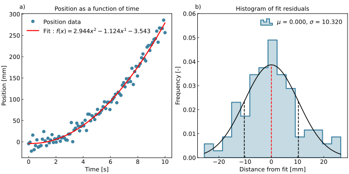

<div style="width: 100%;">
  <a href="https://www.graphinglib.org/" target="_blank">
    
  </a>
</div>

[](https://badge.fury.io/py/graphinglib)
[](https://graphinglib.readthedocs.io/en/latest/?badge=latest)
[](https://opensource.org/licenses/MIT)
[](https://pypi.org/project/graphinglib/)


# GraphingLib

<div style="text-align: center;">
  
</div>

GraphingLib is an open-source data visualization library in Python, designed as a wrapper for matplotlib. It integrates powerful data manipulation features from libraries such as scipy, shapely, and others.

GraphingLib has the following explicit goals:

1. **Simplify Plotting:** Provide the simplest, most intuitive, and user-friendly API to enable users to create plots in as few lines of code as possible.
2. **Data Analysis Functions**: Implement common data analysis functions and operations to streamline the visualization process.
3. **Custom Figure Styles:** Facilitate the customization and reuse of figure styles.

## How is GraphingLib different?

- **Object-Oriented Plotting:** Figures and plotted elements are all objects, making it easier to manage and manipulate plots and elements.
- **Curve Fitting:** Perform curve fitting with a single line of code.
- **Curve Operations:** Carry out differentiation, integration, arithmetic, intersections, and other standard operations on Curve objects.
- **GUI Style Editor:** Use the GraphingLib Style Editor to create and modify custom styles, and set them as your default style.
- **MultiFigures:** Combine different Figure objects into one MultiFigure with one line of code.
- **Polygon Manipulation:** Obtain useful information such as area, centroid, and perimeter of polygons, and manipulate them using transform and set operations methods.

## Getting started

To get started with GraphingLib, check out our comprehensive [documentation and examples](https://www.graphinglib.org/) available on our website. Whether you're a beginner or an experienced user, our documentation provides step-by-step guides to help you make the most out of GraphingLib. Here are a few ways to install GraphingLib:

From PyPI with

```text
pip install graphinglib
```

From source with

```text
pip install git+https://github.com/GraphingLib/GraphingLib.git
```

Using Poetry with

```text
poetry add graphinglib
```

## Contributing

We welcome contributions from the community. If you're interested in contributing to GraphingLib, please read our [contribution guidelines](https://www.graphinglib.org/en/stable/contributing.html) on our documentation website.

## Example
Here is a short example showing how to use GraphingLib to create a figure with a scatter plot, a fit, and a histogram of the residuals.
    
```python
import graphinglib as gl
import numpy as np

# Data creation
np.random.seed(2)
x_data = np.linspace(0, 10, 100)
y_data = 3 * x_data**2 - 2 * x_data + np.random.normal(0, 10, 100)

# Create elements
scatter = gl.Scatter(x_data, y_data, label="Position data")
fit = gl.FitFromPolynomial(scatter, degree=2, label="Fit", color="red")
residuals = gl.Histogram.from_fit_residuals(fit, number_of_bins=15)
residuals.add_pdf("normal")

# Create and show figures
fig1 = gl.Figure(
    x_label="Time [s]",
    y_label="Position [mm]",
    title="Position as a function of time",
)
fig1.add_elements(scatter, fit)

fig2 = gl.Figure(
    y_lim=(0, 0.06),
    x_label="Distance from fit [mm]",
    y_label="Frequency [-]",
    title="Histogram of fit residuals",
)
fig2.add_elements(residuals)

multifigure = gl.MultiFigure.from_row([fig1, fig2], size=(10, 5))
multifigure.show()
```


