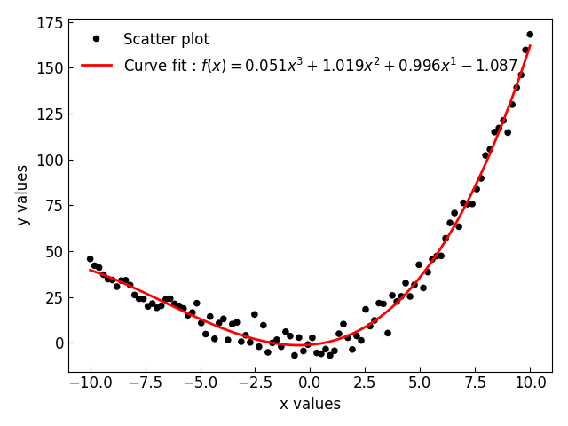

# GraphingLib

<div style="text-align:center"></div>

## Description


## Installation

From source with

```text
pip install git+https://github.com/GraphingLib/GraphingLib.git
```

## Quick usage

```python
import graphinglib as gl
import numpy as np

# Create some noisy random data :
x_data = np.linspace(-10, 10, 100)
noise = np.random.normal(0, 5, len(x_data))
y_data = 0.05 * x_data ** 3 + x_data ** 2 + x_data + noise

# Create the Scatter object
scatter = gl.Scatter(x_data, y_data, label="Scatter plot")

# Create a curve fit
fit = gl.FitFromPolynomial(scatter, degree=3, label="Curve fit")

# Create the figure object and add the Scatter object to the figure
fig_1 = gl.Figure(x_label="x values", y_label="y values")
fig_1.add_element(scatter)

# Display the figure
fig_1.generate_figure()
```
<div style="text-align:center"></div>

