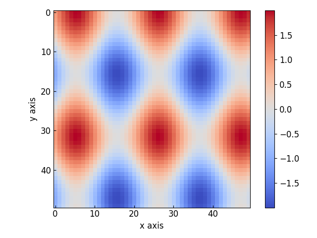
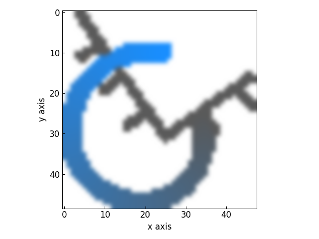

==============
Plotting in 2D
==============

The :class:`~graphinglib.data_plotting_2d.Contour` Object
---------------------------------------------------------

The :class:`~graphinglib.data_plotting_2d.Heatmap` Object
---------------------------------------------------------

The Heatmap class allows to plot a 2-dimensional map of values. It also allows to display images inside a set of axes. Here is how you can create a heatmap: ::

    x_grid, y_grid = np.mgrid[:50, :50]
    data = np.cos(x_grid * 0.2) + np.sin(y_grid * 0.3)

    map = gl.Heatmap(data)
    figure = gl.Figure()
    figure.add_element(map)
    figure.display()

As for the :class:`~graphinglib.data_plotting_1d.Curve` and :class:`~graphinglib.data_plotting_1d.Scatter` objects, it is possible to create a Heatmap from a function with the :py:meth:`~graphinglib.data_plotting_2d.Heatmap.from_function` method: ::

    map = gl.Heatmap.from_function(
        lambda y, x: np.cos(x * 0.2) + np.sin(y * 0.3), (0, 49), (49, 0)
    )

To display an image instead, simply create a Heatmap with the path to an image as a string instead of actual data: ::

    map = gl.Heatmap("images/GraphingLib-logo.png")
    figure = gl.Figure()
    figure.add_element(map)
    figure.display()

The are again many parameters to control for the Heatmap objects but an important one to mention here is the ``interpolation`` parameter. This allows you to choose an interpolation method to apply to the Heatmap data (image or not). The possible values for this parameter are the `interpolation methods for imshow from Matplotlib <https://matplotlib.org/stable/gallery/images_contours_and_fields/interpolation_methods.html>`_. Using the ``bicubic`` interpolation on the GraphingLib logo before: ::

    map = gl.Heatmap("images/GraphingLib-logo.png", interpolation="bicubic")
    figure = gl.Figure()
    figure.add_element(map)
    figure.display()

The :class:`~graphinglib.data_plotting_2d.VectorField` Object
-------------------------------------------------------------

