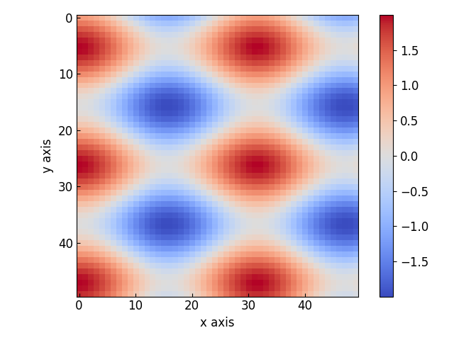
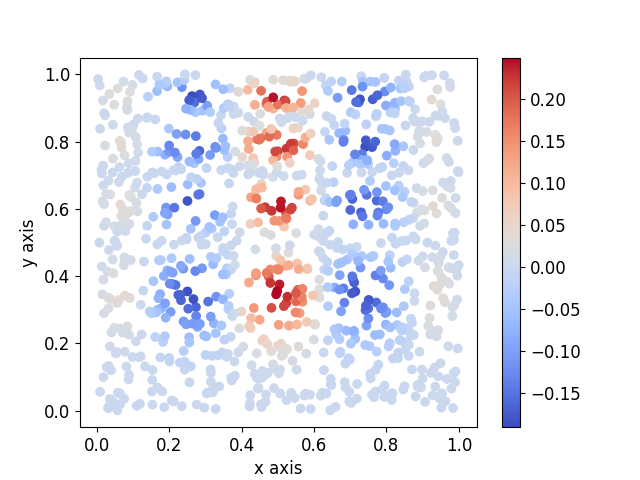
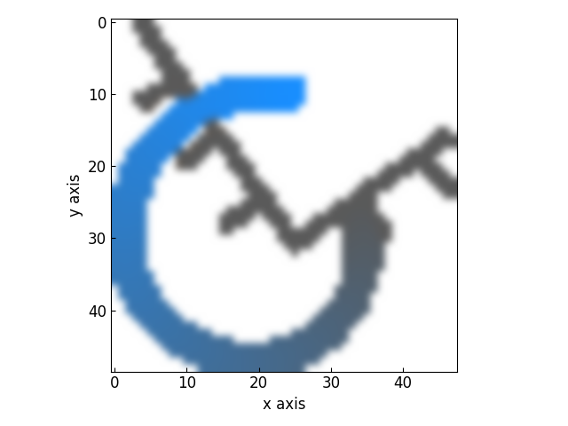
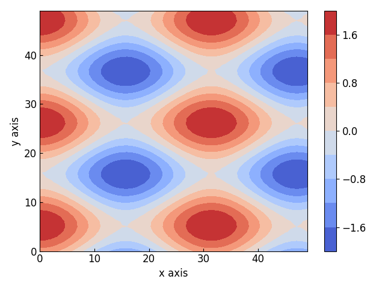
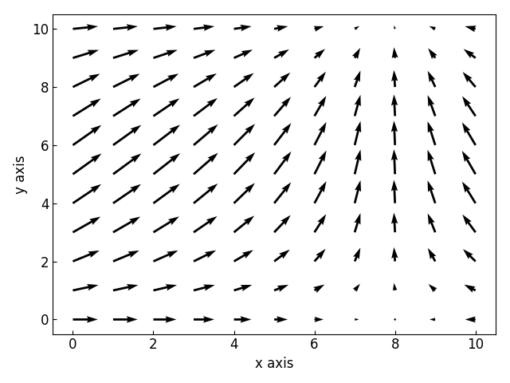
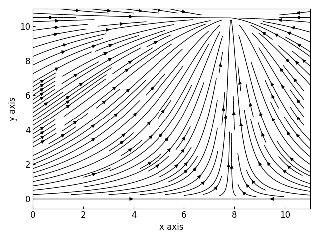

==============
Plotting in 2D
==============

The :class:`~graphinglib.data_plotting_2d.Heatmap` Object
---------------------------------------------------------

The Heatmap class allows you to plot a 2-dimensional map of values or display images inside a set of axes. Here is how you can create a Heatmap: ::

    x_grid, y_grid = np.meshgrid(np.arange(0, 50, 1), np.arange(0, 50, 1))
    data = np.cos(x_grid * 0.2) + np.sin(y_grid * 0.3)

    map = gl.Heatmap(data)
    figure = gl.Figure()
    figure.add_element(map)
    figure.display()

As for the :class:`~graphinglib.data_plotting_1d.Curve` and :class:`~graphinglib.data_plotting_1d.Scatter` objects, it is possible to create a Heatmap from a function with the :py:meth:`~graphinglib.data_plotting_2d.Heatmap.from_function` method: ::

    map = gl.Heatmap.from_function(
        lambda x, y: np.cos(x * 0.2) + np.sin(y * 0.3), (0, 49), (49, 0)
    )

It is also possible to create a Heatmap from a list or array of values at unevenly distributed points. Take for example the data displayed below:

The :py:meth:`~graphinglib.data_plotting_2d.Heatmap.from_points` method used below will interpolate the data on a grid and create a Heatmap from this interpolated data: ::

    def func(x, y):
        return x * (1 - x) * np.cos(4 * np.pi * x) * np.sin(4 * np.pi * y**2) ** 2

    rng = np.random.default_rng()
    points = rng.random((1000, 2))
    values = func(points[:, 0], points[:, 1])

    fig = gl.Figure()
    hm = gl.Heatmap.from_points(
        points,
        values,
        (0, 1),
        (0, 1),
        grid_interpolation="cubic",
        number_of_points=(100, 100),
        origin_position="lower",
    )
    fig.add_element(hm)
    fig.display()

.. image:: images/data_even.png

To display an image instead, simply create a Heatmap with the path to an image as a string instead of actual data: ::

    map = gl.Heatmap("images/GraphingLib-logo.png")
    figure = gl.Figure()
    figure.add_element(map)
    figure.display()

There are again many parameters to control for the Heatmap objects but an important one to mention here is the ``interpolation`` parameter. This allows you to choose an interpolation method to apply to the Heatmap data (image or not). The possible values for this parameter are the `interpolation methods for imshow from Matplotlib <https://matplotlib.org/stable/gallery/images_contours_and_fields/interpolation_methods.html>`_. Using the ``bicubic`` interpolation on the GraphingLib logo before: ::

    map = gl.Heatmap("images/GraphingLib-logo.png", interpolation="bicubic")
    figure = gl.Figure()
    figure.add_element(map)
    figure.display()

.. note :: By default, there is no interpolation applied to the data.

The :class:`~graphinglib.data_plotting_2d.Contour` Object
---------------------------------------------------------

The Contour class allows you to display a contour plot of 2-dimensional data. Here is an example of how to create a Contour object from the same data used in the Heatmap examples: ::

    x_grid, y_grid = np.meshgrid(np.arange(0, 50, 1), np.arange(0, 50, 1))
    data = np.cos(x_grid * 0.2) + np.sin(y_grid * 0.3)

    contour = gl.Contour(x_grid, y_grid, data)
    figure = gl.Figure()
    figure.add_element(map)
    figure.display()

The contour class also has a :py:meth:`~graphinglib.data_plotting_2d.Contour.from_function` method: ::

    x_grid, y_grid = np.meshgrid(np.arange(0, 50, 1), np.arange(0, 50, 1))
    contour = gl.Contour.from_function(
        lambda x, y: np.cos(x * 0.2) + np.sin(y * 0.3), x_grid, y_grid
    )

The :class:`~graphinglib.data_plotting_2d.VectorField` Object
-------------------------------------------------------------
As its name suggests, the VectorField class allows you to plot a 2-dimensional vector field. Here is an example of its usage: ::

    x_grid, y_grid = np.meshgrid(np.arange(0, 11, 1), np.arange(0, 11, 1))
    u, v = (np.cos(x_grid * 0.2), np.sin(y_grid * 0.3))
    
    vector = gl.VectorField(x_grid, y_grid, u, v, arrow_length_multiplier=2)
    figure = gl.Figure()
    figure.add_element(vector)
    figure.display()

As both classes discussed prior, the VectorField object has a :py:meth:`~graphinglib.data_plotting_2d.VectorField.from_function` method: ::

    vector = gl.VectorField.from_function(
        lambda x, y: (np.cos(x * 0.2), np.sin(y * 0.3)), (0, 11), (0, 11)
    )

The :class:`~graphinglib.data_plotting_2d.Stream` Object
--------------------------------------------------------

The Stream class allows you to create stream plots in GraphingLib. Here is an example of its usage: ::

    import graphinglib as gl
    import numpy as np

    x_grid, y_grid = np.meshgrid(np.linspace(0, 11, 30), np.linspace(0, 11, 30))
    u, v = (np.cos(x_grid * 0.2), np.sin(y_grid * 0.3))

    stream = gl.Stream(x_grid, y_grid, u, v, density=1.5)
    figure = gl.Figure()
    figure.add_element(stream)
    figure.display()

The density parameter used in the example above is the density of stream lines to display. The default density is set to 1, which means that the plotting domain is divided into a 30x30 grid in which each square can only be traversed by one stream line. Note that it is also possible to create a Stream from a function using its :py:meth:`~graphinglib.data_plotting_2d.Stream.from_function` method: ::

    stream = gl.Stream.from_function(
        lambda x, y: (np.cos(x * 0.2), np.sin(y * 0.3)), (0, 11), (0, 11), density=1.5
    )
