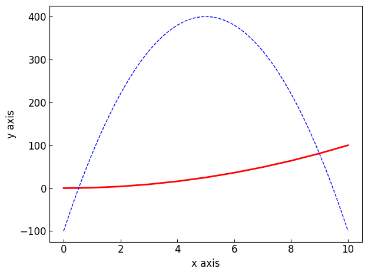

===================================================================
The :class:`~graphinglib.data_plotting_1d.Curve` and its operations
===================================================================

In GraphingLib, all curves are objects which are instances of the :class:`~graphinglib.data_plotting_1d.Curve` class. You can create a curve in two ways. The first is to create a curve from lists of x and y values, and the second is to create a curve from a function. ::

    import graphinglib as gl

    # Create a curve from lists of x and y values
    x_values = [0, 1, 2, 3, 4, 5, 6, 7, 8, 9, 10]
    y_values = [0, 1, 4, 9, 16, 25, 36, 49, 64, 81, 100]
    curve_1 = gl.Curve(x_values, y_values)

    # Create a curve from a function
    curve_2 = gl.Curve.from_function(lambda x: -20 * (x - 5) ** 2 + 400, x_min=0, x_max=10)

    fig = gl.Figure()
    fig.add_element(curve_1, curve_2)
    fig.display()

Basic curve arithmetic
----------------------

The :class:`~graphinglib.data_plotting_1d.Curve` class has a number of methods which can be used to manipulate the curve. For example, you can add two curves together, or multiply a curve by a constant. ::

    # Add the two curves together
    curve_3 = curve_1 + curve_2

    # Multiply the curve by a constant (make sure the constant is on the right)
    curve_4 = curve_1 * 2

    fig = gl.Figure()
    fig.add_element(curve_1, curve_2, curve_3, curve_4)
    fig.display()

Addition, subtraction, multiplication and division is generally supported between any two curves, as long as they are plotted using the same number of points. These four operations are also supported between a curve and a constant.

You can also find the the maximum and minimum values of a curve using the standard Python functions :func:`max` and :func:`min`. ::

    max_value = max(curve_1)
    min_value = min(curve_1)

Identifying points on a curve
-----------------------------

The :class:`~graphinglib.data_plotting_1d.Curve` class has two interpolation methods which can be used to create :class:`~graphinglib.graph_elements.Point` objects on the curve at a given x or y value. The :meth:`~graphinglib.data_plotting_1d.Curve.get_point_at_x` method returns a :class:`~graphinglib.graph_elements.Point` on the curve at a given x value, and the :meth:`~graphinglib.data_plotting_1d.Curve.get_points_at_y` method returns a list of all points on the curve at a given y value. Another really useful method is the :meth:`~graphinglib.data_plotting_1d.Curve.intersection` method, which returns a list of all the points of intersection between two curves. You can then add these points to the figure as shown below. ::

    # Create a point on the curve at x = 5
    point_1 = curve_1.point_from_x_value(5)

    # Create a point on the curve at y = 25
    point_2 = curve_1.point_from_y_value(25)

    fig = gl.Figure()
    fig.add_element(curve_1, point_1, point_2)
    fig.display()

Curve calculus
--------------

There are a number of methods which can be used to perform calculus on a curve. The :meth:`~graphinglib.data_plotting_1d.Curve.get_derivative_curve` and :meth:`~graphinglib.data_plotting_1d.Curve.get_integral_curve` both return new :class:`~graphinglib.data_plotting_1d.Curve` objects. You can also use the :meth:`~graphinglib.data_plotting_1d.Curve.get_tangent_curve` and :meth:`~graphinglib.data_plotting_1d.Curve.get_normal_curve` methods to plot tangents and normals to other curves at a given x value. ::

    # Get the derivative of the curve
    derivative_curve = curve_1.get_derivative_curve()

    # Get the integral of the curve
    integral_curve = curve_1.get_integral_curve()

    # Get the tangent to the curve at x = 5
    tangent_curve = curve_1.get_tangent_curve(5)

    # Get the normal to the curve at x = 5
    normal_curve = curve_1.get_normal_curve(5)

    fig = gl.Figure()
    fig.add_element(curve_1, derivative_curve, integral_curve, tangent_curve, normal_curve)
    fig.display()

The :meth:`~graphinglib.data_plotting_1d.Curve.area_between` method can be used to calculate the area under a curve between two x values (and shade it in if you want). The :meth:`~graphinglib.data_plotting_1d.Curve.slope_at` method can be used to calculate the slope of a curve at a given x value, and the :meth:`~graphinglib.data_plotting_1d.Curve.arc_length_between` method can be used to calculate the arc length of a curve between two x values. :: 

    # Get the area between the two curves
    area = curve_1.get_area_between(curve_2, fill_under=True)

    # Get the slope of the curve at x = 5
    slope = curve_1.get_slope_at(5)

    # Get the arc length of the curve between x = 0 and x = 10
    arc_length = curve_1.get_arc_length_between(0, 10)

    fig = gl.Figure()
    fig.add_element(curve_1)
    fig.display()