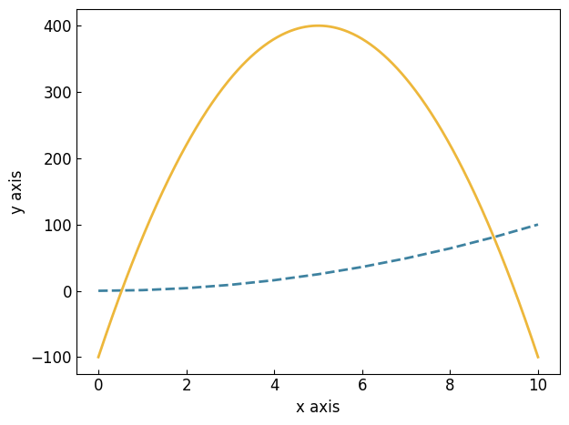
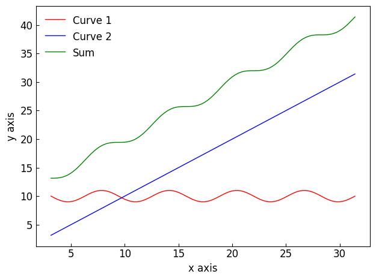
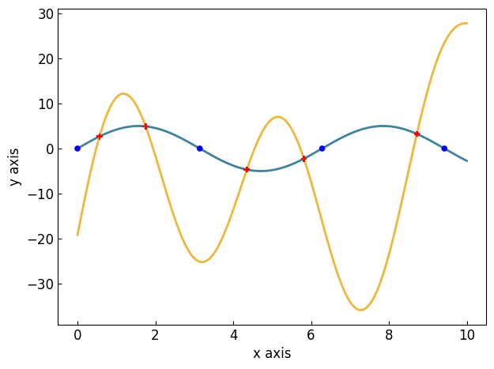
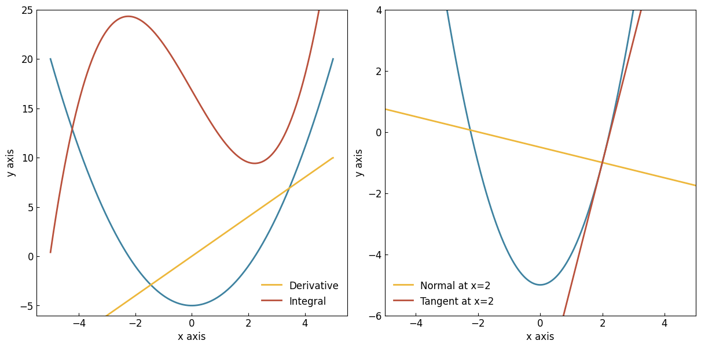
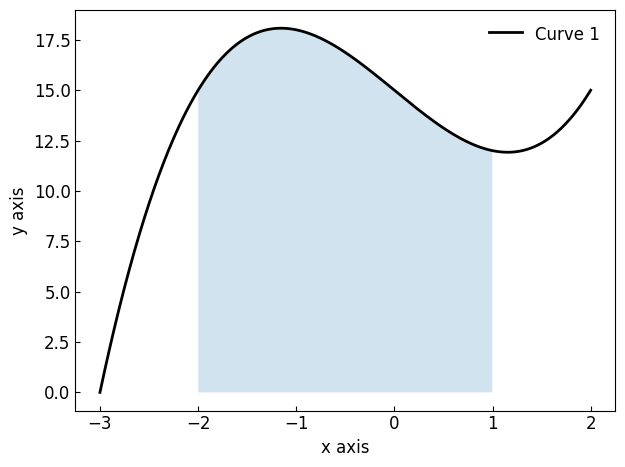

===================================================================
The :class:`~graphinglib.data_plotting_1d.Curve` and its operations
===================================================================

In GraphingLib, all curves are objects which are instances of the :class:`~graphinglib.data_plotting_1d.Curve` class. You can create a curve in two ways. The first is to create a curve from lists (or numpy arrays) of x and y values, and the second is to create a curve from a function. ::

    import graphinglib as gl

    # Create a curve from lists of x and y values
    x_values = [0, 1, 2, 3, 4, 5, 6, 7, 8, 9, 10]
    y_values = [0, 1, 4, 9, 16, 25, 36, 49, 64, 81, 100]
    curve_1 = gl.Curve(x_values, y_values, line_style="--")

    # Create a curve from a function
    curve_2 = gl.Curve.from_function(lambda x: -20 * (x - 5) ** 2 + 400, x_min=0, x_max=10)

    fig = gl.Figure()
    fig.add_element(curve_1, curve_2)
    fig.display()

Basic curve arithmetic
----------------------

The :class:`~graphinglib.data_plotting_1d.Curve` class has a number of methods which can be used to create new curves from basic mathematical operations on existing ones. For example, you can add two curves together, or multiply a curve by a constant. ::

    curve_1 = gl.Curve.from_function(
        lambda x: np.sin(x) + 10, np.pi, 10 * np.pi, label="Curve 1", number_of_points=100,
    )
    curve_2 = gl.Curve.from_function(
        lambda x: x, np.pi, 10 * np.pi, label="Curve 2", number_of_points=100,
    )

    curve_sum = curve_1 + curve_2
    curve_sum.label = "Sum"

    fig = gl.Figure()
    fig.add_element(curve_1, curve_2, curve_sum)
    fig.display()

Addition, subtraction, multiplication and division is generally supported between any two curves, as long as they are plotted using the same number of points. These four operations are also supported between a curve and a constant. When creating new curves with +, -, \*, or /, you can still access and change the curve properties such as the color and label through the new curve object using dot notation.

You can also find the the maximum and minimum values of a curve (maximum or minimum y value) using the standard Python functions :func:`max` and :func:`min`. ::

    max_value = max(curve_1)
    min_value = min(curve_1)

Identifying points on a curve
-----------------------------

The :class:`~graphinglib.data_plotting_1d.Curve` class includes interpolation methods for creating coordinates and points on a curve at a specific x or y value. The :meth:`~graphinglib.data_plotting_1d.Curve.get_coordinates_at_x` method returns a tuple of coordinates (x, y) representing a point on the curve at a given x value. Similarly, the :meth:`~graphinglib.data_plotting_1d.Curve.get_coordinates_at_y` method returns a list of tuples (since a function can cross a y value at multiple points), each representing the coordinates of a point on the curve at the given y value. Alternatively, the :meth:`~graphinglib.data_plotting_1d.Curve.create_point_at_x` and :meth:`~graphinglib.data_plotting_1d.Curve.create_points_at_y` methods create a :class:`~graphinglib.graph_elements.Point` object or a list of such objects which can then be added to a Figure. Additionally, the :meth:`~graphinglib.data_plotting_1d.Curve.get_intersection_coordinates` and :meth:`~graphinglib.data_plotting_1d.Curve.create_intersection_points` methods, which identify the points of intersection between two curves, also follow this logic. ::

    import graphinglib as gl
    import numpy as np

    curve_1 = gl.Curve.from_function(lambda x: 5 * np.sin(x), 0, 10)

    curve_2 = gl.Curve.from_function(
        lambda x: 0.3 * (x - 4) ** 3 - 0.5 * x**2 + 20 * np.sin(1.5 * x), 0, 10
    )

    # Get the points of intersection between the two curves
    intersection_points = curve_1.create_intersection_points(curve_2, marker_styles="P", colors="red")
    # Get points where curve 1 crosses the x axis (where y = 0)
    cross_x_axis_points = curve_1.create_points_at_y(0, color="blue")

    # Print coordinates of first intersection point
    first_int = curve_1.get_intersection_coordinates(curve_2)[0]
    print(f"First intersection point: {first_int}")

    fig = gl.Figure()
    fig.add_element(curve_1, curve_2)
    # Use the * operator to add a list of elements to the figure all at once
    fig.add_element(*intersection_points, *cross_x_axis_points)
    fig.display()

.. code-block:: none
    
        First intersection point: (0.5651742229068757, 2.677727491121997)

Curve calculus
--------------

There are a number of methods which can be used to perform calculus on a curve. The :meth:`~graphinglib.data_plotting_1d.Curve.create_derivative_curve` and :meth:`~graphinglib.data_plotting_1d.Curve.create_integral_curve` both return new :class:`~graphinglib.data_plotting_1d.Curve` objects. You can also use the :meth:`~graphinglib.data_plotting_1d.Curve.create_tangent_curve` and :meth:`~graphinglib.data_plotting_1d.Curve.create_normal_curve` methods to plot tangents and normals to other curves at a given x value. ::

    curve_1 = gl.Curve.from_function(lambda x: x**2 - 5, x_min=-5, x_max=5)

    derivative_curve = curve_1.create_derivative_curve(label="Derivative")
    integral_curve = curve_1.create_integral_curve(label="Integral")
    normal_curve = curve_1.create_normal_curve(2, label="Normal at x=2")
    tangent_curve = curve_1.create_tangent_curve(2, label="Tangent at x=2")

    fig1 = gl.Figure(y_lim=(-6, 25))
    fig1.add_element(curve_1, derivative_curve, integral_curve)

    fig2 = gl.Figure(x_lim=(-5, 5), y_lim=(-6, 4))
    fig2.add_element(curve_1, normal_curve, tangent_curve)

    multifig = gl.MultiFigure.row([fig1, fig2], size=(12, 6), reference_labels=False)
    multifig.display()

The :meth:`~graphinglib.data_plotting_1d.Curve.get_area_between` method can be used to calculate the area under a curve between two x values (and shade it in if you want). The :meth:`~graphinglib.data_plotting_1d.Curve.get_slope_at` method can be used to calculate the slope of a curve at a given x value, and the :meth:`~graphinglib.data_plotting_1d.Curve.get_arc_length_between` method can be used to calculate the arc length of a curve between two x values. ::

    curve_1 = gl.Curve.from_function(lambda x: x**3 - 4 * x + 15, -3, 2, label="Curve 1")

    # fill_under shades in the area under the curve
    area = curve_1.get_area_between(-2, 1, fill_under=True)

    slope = curve_1.get_slope_at(0)

    arc_length = curve_1.get_arc_length_between(0, 2)

    print(f"Area under the curve between x = -2 and x = 1: {area}")
    print(f"Slope of the curve at x = 0: {slope}")
    print(f"Arc length of the curve between x = 0 and x = 2: {arc_length}")

    fig = gl.Figure()
    fig.add_element(curve_1)
    fig.display()

.. code-block:: none

    Area under the curve between x = -2 and x = 1: 47.24991797167644
    Slope of the curve at x = 0: -3.9998273099304695
    Arc length of the curve between x = 0 and x = 2: 6.634026509067356

