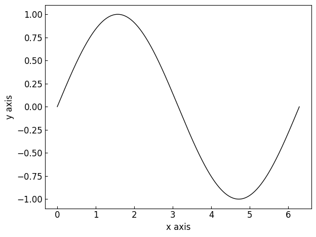

=====================================================
Creating a simple :class:`~graphinglib.figure.Figure`
=====================================================

Creating a basic figure using the :class:`~graphinglib.figure.Figure` object is easy. Here is an example of what plotting a sine function can look like. ::

    import numpy as np
    import graphinglib as gl
    

    figure = gl.Figure()

    sine = gl.Curve.from_function(lambda x: np.sin(x), 0, 2 * np.pi)

    figure.add_element(sine)
    figure.display()

The :py:meth:`~graphinglib.figure.Figure.display` method is used to show the figure on screen. It is also possible to use the :py:meth:`~graphinglib.figure.Figure.save` method to save the figure to a specified path.

.. seealso:: 
    
    For the documentation on the ``from_function`` method, see the :py:meth:`Reference section on the Curve object <graphinglib.data_plotting_1d.Curve.from_function>` or the :doc:`handbook section on curves </handbook/curve>`.

We can specify the axis labels by using the ``x_label`` and ``y_label`` parameters of the figure. ::

    figure = gl.Figure(x_label="Time (s)", y_label="Potential (V)")

For further informations on the available parameters, please refer to the :doc:`Reference section on Figure objects <../reference/figure>`.

Figure styles
--------------------------

The ``figure_style`` parameter of the :class:`~graphinglib.figure.Figure` class allows you to specify a predefined style to use to change the appearance of the figure and the elements plotted inside it. You can specify a predefined style as follows: ::

    figure = gl.Figure(x_label="Time (s)", y_label="Potential (V)", figure_style="plain")

There are 3 categories of predefined styles.

- GraphingLib styles are styles that we have created and that are always available. The default style called "plain" is one of these, and you can see the others at the bottom of :doc:`this page</handbook/figure_style_file>`.
- All Matplotlib styles are also available. You can see the list of available Matplotlib styles `here <https://matplotlib.org/stable/gallery/style_sheets/style_sheets_reference.html>`_. To use the default Matplotlib style, simply specify "matplotlib" as the style.
- You can also create, save and specify your own custom styles.

It is important to note that the parameters controlled by the specified style can be overridden simply by specifying the desired options. **The explicitly specified options will always be prioritized.**

.. seealso:: For the instructions on how to write your own figure style file and see what parameters are controlled by the figure style files, see :doc:`/handbook/figure_style_file`.

Style customization
-------------------

After you've created a Figure and set its ``figure_style``, it is possible to customize its appearance further by using the :py:meth:`~graphinglib.figure.Figure.customize_visual_style` or the :py:meth:`~graphinglib.figure.Figure.update_rc_params` methods. The first method allows you to specify the options directly, while the second method allows you to specify the options using a dictionary of matplotlib rc parameters. Only the most common options are available using the first method, while the second method allows you to specify any matplotlib rc parameter. Here is an example using the first method: ::

    figure = gl.Figure(x_label="Time (s)", y_label="Potential (V)", figure_style="plain")
    figure.customize_visual_style(
        use_latex=True,
        font_size=12,
        axes_edge_color="red",
    )

And here is an example using the second method: ::

    figure = gl.Figure(x_label="Time (s)", y_label="Potential (V)", figure_style="plain")
    figure.update_rc_params(
        {
            "font.size": 12,
            "axes.edgecolor": "red",
            "text.usetex": True,
        }
    )

Both work fine, but the first method lets you take advantage of the power of your IDE's popup suggestions and saves you from having to look up the matplotlib rc parameters names for the most common options.

.. note:: If you find yourself using the same options over and over again, you may want to create your own figure style file. It's much easier than it sounds and will save you a lot of time! See :doc:`/handbook/figure_style_file` for more information.