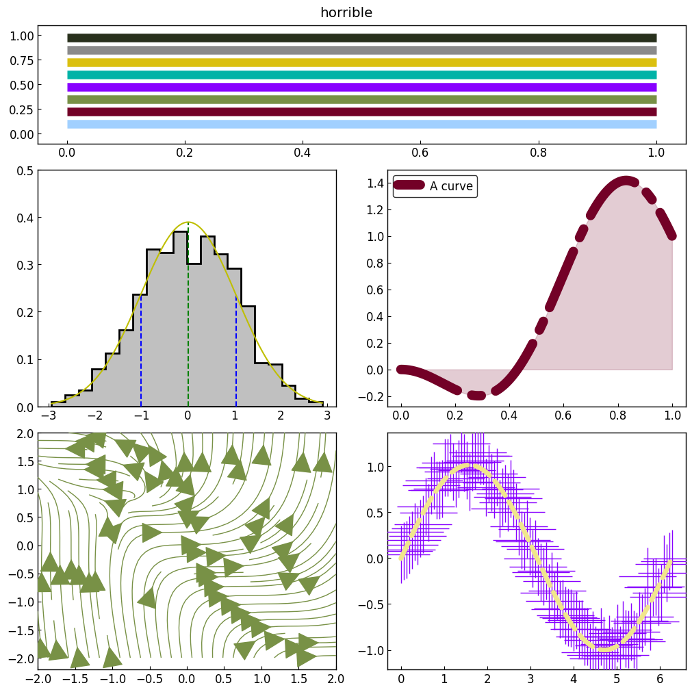

==================================
Writing your own figure style file
==================================

In GraphingLib, all objects have default values for most parameters. For example, a curve object has a default line width, and a figure object has a default background color. These defaults are governed by the style you choose to give your figure when creating it:

.. code-block:: python

    fig = Figure(style='plain')
    fig2 = Figure(style='dark')

GraphingLib has a number of built-in styles which are showcased at the bottom of this page. The parameters controlled by styles are called "defaults" for a reason; they can always be overridden by explicitely specifying a parameter when creating an object:

.. code-block:: python

    fig = Figure(figure_style="dark") # uses the "dark" style

    fig2 = Figure(figure_style="dark")
    fig2.set_visual_params(axes_edge_color="red") # "dark" style, but axes color is overridden

If no style is specified, the user's default style is used. This default style can be set by the user using the `set_default_style` function or by using GraphingLib's Style Editor. Once set, the default style will be saved and used for all figures created without a specified style. The default style can also be retrieved using the `get_default_style` function.

.. code-block:: python

    print(gl.get_default_style()) # prints "plain"
    gl.set_default_style("dark")
    print(gl.get_default_style()) # prints "dark"

When you install GraphingLib for the first time, the default style is the "plain" style. You can also create your own styles or modify existing ones. To do this, you can use GraphingLib's Style Editor as described below.

GraphingLib's Style Editor
---------------------------

If you have GraphingLib installed, you can run the following command in the terminal:

.. code-block:: bash

    glse

You will be greeted with a GUI which allows you to create, edit, and delete styles. The Style Editor interface consists of a left panel and a right panel, which let you customize and previewing styles respectively. In the left panel, you can adjust all the style settings for the currently opened style. These changes are immediately reflected in the right panel, which displays a figure with the applied customizations. You can see how the style appears in different contexts by browsing through the example figures provided within the interface. If Auto Switch is checked, the example figure will automatically switch to the most appropriate example depending on what customization tab you are currently on. Additionally, there is an option to upload a custom Python script that creates a GraphingLib figure, allowing users to apply and preview the style on their own figures.

Create a new style
~~~~~~~~~~~~~~~~~~

To create a new style, go to File → New. You will be asked to choose an existing style to use as a starting point.

You can now customize the style by going through the different tabs in the left panel. Remember, you are choosing the default values for each object type: these are the values that will be used if you do not specify a parameter when creating an object. You will always be able to override these defaults by explicitely specifying a parameter.

Once you're happy with your style, you can go to File → Save and you will be prompted to enter a name for your new style. Any styles you create will be saved to a platform-specific user configuration directory created by GraphingLib when your first custom style is generated (you don't have to worry about choosing where to save your styles). This means that if you uninstall GraphingLib or update it, your styles will not be deleted. There is also a built-in mechanism which updates your custom styles automatically when new objects or parameters are added to GraphingLib with an update. You can therefore safely update GraphingLib without worrying about your custom styles breaking. Any new objects or parameters will be set to the same value as the "plain" style, but you can always edit your custom styles later.

Edit an existing style
~~~~~~~~~~~~~~~~~~~~~~

You can open an existing style by going to File → Open. You will be presented with a list of existing styles to choose from. You can then proceed as usual, editing the style to your liking. Once you are done, you can either save your changes to the existing style by going to File → Save, or you can save your changes to a new style by going to File → Save As.

You will notice that you can also edit GraphingLib's built-in styles (GraphingLib will prioritize your edited versions if they exist). Don't worry, this will not break anything. If you want to revert to the original style, you can always delete your custom style and GraphingLib will fall back to the built-in style again. For example, if you want to edit the "dark" style, you can open it, make your changes, and save it. GraphingLib will now use your edited version of the "dark" style instead of the built-in one. If you want to revert to the original "dark" style, you can delete your edited version of it and GraphingLib will use the built-in "dark" style again.

At any time, you can click on "View unsaved changes" to see what changes you have made to the style since you last saved it. This can be useful if you want to make sure you haven't accidentally changed something you didn't mean to.

Manage styles
~~~~~~~~~~~~~

If you want to view and manage all your styles, you can go to File → Manage styles. Here you can see a list of all your custom styles, as well as the built-in styles. There is a color legend to help you distinguish between built-in and custom styles. You can also identify which built-in styles are currently overridden by a custom style of the same name by the small "2" icon next to the style name.

Once you have selected a style in the list, you are presented with four options:

- Rename: Change the name of the style. You can only rename custom styles. Built-in styles cannot be renamed, but you can duplicate them and rename the duplicate.
- Duplicate: Create a copy of the style with a new name.
- Delete: Delete the style. You can only delete custom styles. Built-in styles cannot be deleted. Deleting a custom style which overrides a built-in style will revert GraphingLib to using the built-in style.
- Set as default: Set the style as the default style. This means that any figures created without a specified style will use this style. You can see the current default style in the top left corner of the "Manage styles" window.

GraphingLib Styles Showcase
---------------------------
Here are the currently available built-in styles in GraphingLib:

Plain style:

Dim style:

.. image:: images/dim_showcase.png

Dark style:

Horrible style:

