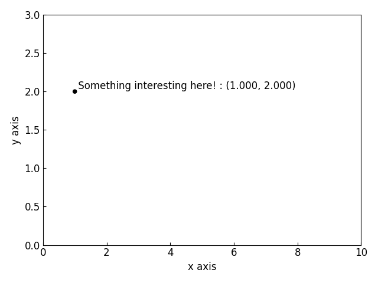
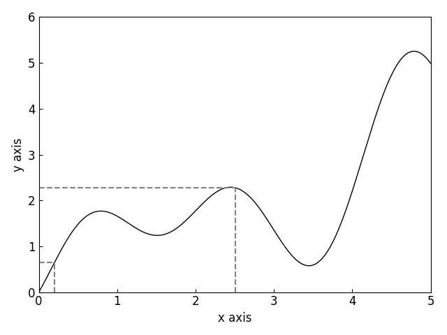
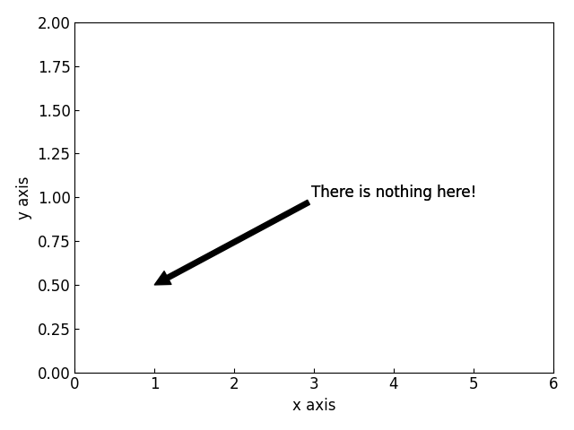
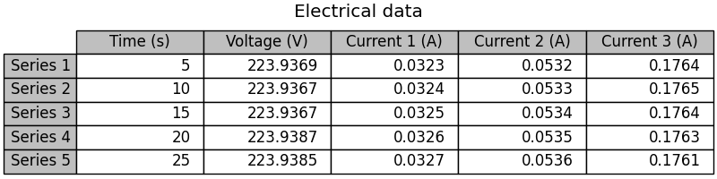

=====================
Miscellaneous Objects
=====================

.. _point:

The :class:`~graphinglib.graph_elements.Point` Object
-----------------------------------------------------

The Point object is usefull for highlighting a specific point in a graph. It allows you to attach a label to it in addition to its coordinates. Here is how to declare a Point object and add its coordinates: ::

    point = gl.Point(1, 2, label="Something interesting here!")
    point.add_coordinates()

There are many more parameters to be customized for the Point object, but those are all included in the figure style files and can therefore be left out most of the time. For the details on the other parameters, visit the :py:class:`Reference section on Point objects <graphinglib.graph_elements.Point>`.

.. seealso::

    The Point object is returned by methods of the :class:`~graphinglib.data_plotting_1d.Curve` objects like :py:meth:`~graphinglib.data_plotting_1d.Curve.get_point_at_x`, :py:meth:`~graphinglib.data_plotting_1d.Curve.get_points_at_y` and :py:meth:`~graphinglib.data_plotting_1d.Curve.intersection`.

The :class:`~graphinglib.graph_elements.Hlines` and :class:`~graphinglib.graph_elements.Vlines` Object
------------------------------------------------------------------------------------------------------

The Hlines and Vlines objects serve a similar purpose to the Point object, which is as markers for specific values in `x` or `y`. Here is an example of the use of Hlines and Vlines: ::

    import numpy as np
    import graphinglib as gl

    curve = gl.Curve.from_function(
        lambda x: 0.1 * x**2 + np.sin(3 * x) - np.cos(2 * x) + 1, 0, 5
    )
    hlines = gl.Vlines(
        [curve.x_data[20], curve.x_data[250]],
        [0, 0],
        [curve.y_data[20], curve.y_data[250]],
        line_styles="--",
        colors="gray",
    )
    vlines = gl.Hlines(
        [curve.y_data[20], curve.y_data[250]],
        [0, 0],
        [curve.x_data[20], curve.x_data[250]],
        line_styles="--",
        colors="gray",
    )

    figure = gl.Figure(x_lim=(0, 5), y_lim=(0, 6))
    figure.add_element(curve, hlines, vlines)
    figure.display()

For both the Hlines and Vlines it is possible to specify as many colors and line styles as there are lines instead of applying the same for all lines as is the case in the example above.

.. _text:

The :class:`~graphinglib.graph_elements.Text` Object
----------------------------------------------------

The Text object is used to display text on a figure. It also allows you to point from the text to a specified point using an arrow. Here is how to declare a text object and attach an arrow to it: ::

    text = gl.Text(4, 1, "There is nothing here!")
    text.attach_arrow((0.5, 1))

There are many more parameters to be customized for the Text object and its arrow, but those are all included in the figure style files and can therefore be left out most of the time. For the details on the other parameters, visit the :py:class:`Reference section on Text objects <graphinglib.graph_elements.Text>`.

The :class:`~graphinglib.graph_elements.Table` Object
-----------------------------------------------------

The Table object is used to display a table of data or any relevant information in a Figure or Multifigure. Here is how to display a simple table of data: ::

    import graphinglib as gl

    data = [
        [5, 223.9369, 0.0323, 0.0532, 0.1764],
        [10, 223.9367, 0.0324, 0.0533, 0.1765],
        [15, 223.9367, 0.0325, 0.0534, 0.1764],
        [20, 223.9387, 0.0326, 0.0535, 0.1763],
        [25, 223.9385, 0.0327, 0.0536, 0.1761],
    ]
    columns = ["Time (s)", "Voltage (V)", "Current 1 (A)", "Current 2 (A)", "Current 3 (A)"]
    rows = ["Series 1", "Series 2", "Series 3", "Series 4", "Series 5"]
    colors = ["#bfbfbf"] * 5

    figure = gl.MultiFigure(
        1, 1, title="Electrical data", reference_labels=False, size=(8, 2)
    )
    subfig = figure.add_SubFigure((0, 0, 1, 1), remove_axes=True)
    table = gl.Table(
        cell_text=data,
        col_labels=columns,
        row_labels=rows,
        row_colors=colors,
        col_colors=colors,
        location="center",
    )
    subfig.add_element(table)
    figure.display()

The Table object has parameters to set the text alignment (``cell_align``, ``row_align`` and ``col_align``), parameters to set the column and row labels' background colors (``col_colors`` and ``row_colors``) and a parameter to set the location of the table with respect to the axes in which it is displayed. It also has a parameter to set the scaling factors of the table in the horizontal and vertical directions. This scaling can be used to leave more verttical or horizontal space for the text in the table's cells. It is set to ``(1, 1.5)`` by default to make the text easier to read than normal Matplotlib tables.

