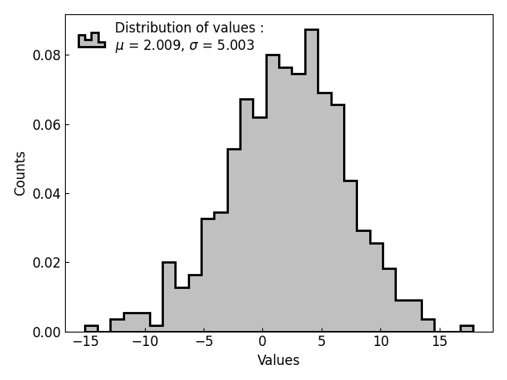
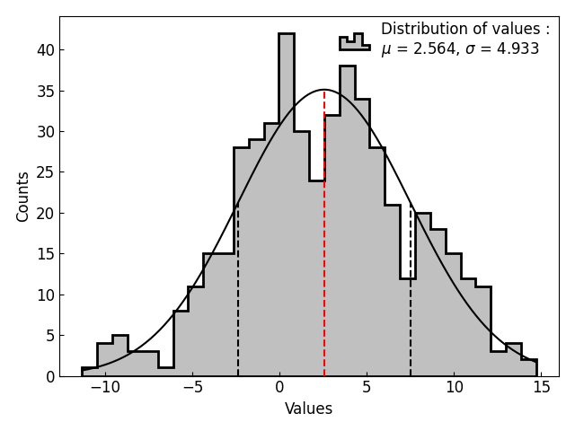

==========================================================
Using the :class:`~graphinglib.data_plotting_1d.Histogram`
==========================================================

Lets start by creating a simple Histogram of a normal distribution. ::

    import numpy as np
    import graphinglib as gl

    values = np.random.normal(loc=2, scale=5, size=500)

    histogram = gl.Histogram(values, number_of_bins=30, label="Distribution of values")

    figure = gl.Figure(x_label="Values", y_label="Counts")
    figure.add_element(histogram)
    figure.display()

On this example we can see that the legend includes the values of the distribution's mean and standard deviation. Those values are also available from the Histogram object with these lines of code ::

    mu = histogram.mean
    sigma = histogram.standard_deviation

It is also possible to overlay a normal fit of the distribution simply by setting the ``show_pdf`` parameter to ``"normal"``: ::

    histogram = gl.Histogram(
        values, number_of_bins=30, label="Distribution of values", show_pdf="normal"
    )

