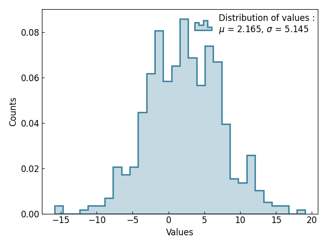
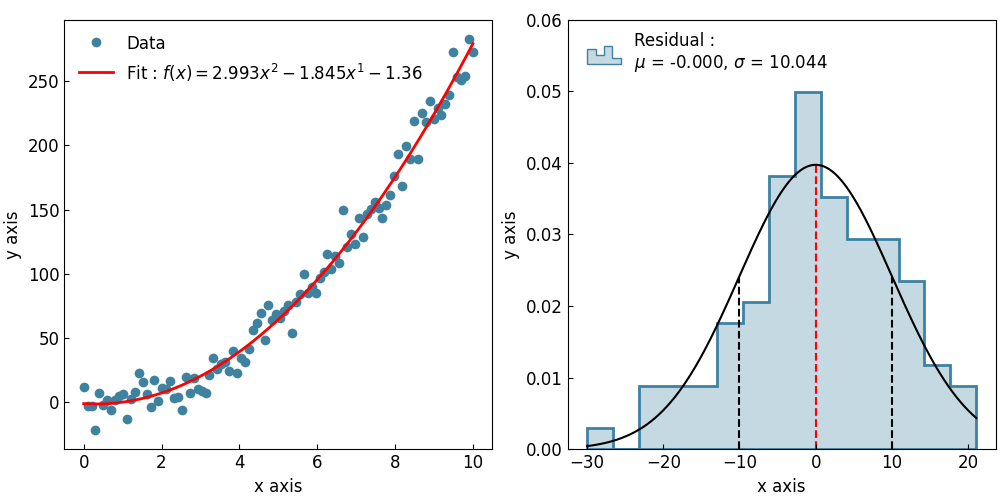

==========================================================
Using the :class:`~graphinglib.data_plotting_1d.Histogram`
==========================================================

Lets start by creating a simple Histogram of a normal distribution. ::

    import numpy as np
    import graphinglib as gl

    values = np.random.normal(loc=2, scale=5, size=500)

    histogram = gl.Histogram(values, number_of_bins=30, label="Distribution of values")

    figure = gl.Figure(x_label="Values", y_label="Counts")
    figure.add_elements(histogram)
    figure.show()

In this example we can see that the legend includes the values of the distribution's mean and standard deviation. These values are also available through the :class:`~graphinglib.data_plotting_1d.Histogram` object using dot notation::

    mu = histogram.mean
    sigma = histogram.standard_deviation

It is also possible to overlay a normal fit of the distribution simply by calling the :py:meth:`~graphinglib.data_plotting_1d.Histogram.add_pdf` (probability density function; currently, only normal is available): ::

    histogram = gl.Histogram(
        values, number_of_bins=30, label="Distribution of values"
    )
    histogram.add_pdf()

.. image:: images/histogrampdf.png

Plotting fit residuals
----------------------

You can create a Histogram from a previously created fit to display the residuals of said fit. Here is an example of how to create such a Histogram using the :py:meth:`~graphinglib.data_plotting_1d.Histogram.plot_residuals_from_fit` method: ::

    import numpy as np
    import graphinglib as gl

    x_data = np.linspace(0, 10, 100)
    y_data = 3 * x_data**2 - 2 * x_data + np.random.normal(0, 10, 100)
    scatter = gl.Scatter(x_data, y_data, label="Data")
    fit = gl.FitFromPolynomial(scatter, degree=2, label="Fit", color="red")
    residuals = gl.Histogram.from_fit_residuals(fit, 15, label="Residual")
    residuals.add_pdf()

    fig1 = gl.Figure()
    fig1.add_elements(scatter, fit)

    fig2 = gl.Figure(y_lim=(0, 0.06))
    fig2.add_elements(residuals)

    multifigure = gl.MultiFigure.from_row([fig1, fig2], size=(10, 5), reference_labels=False)
    multifigure.show()

