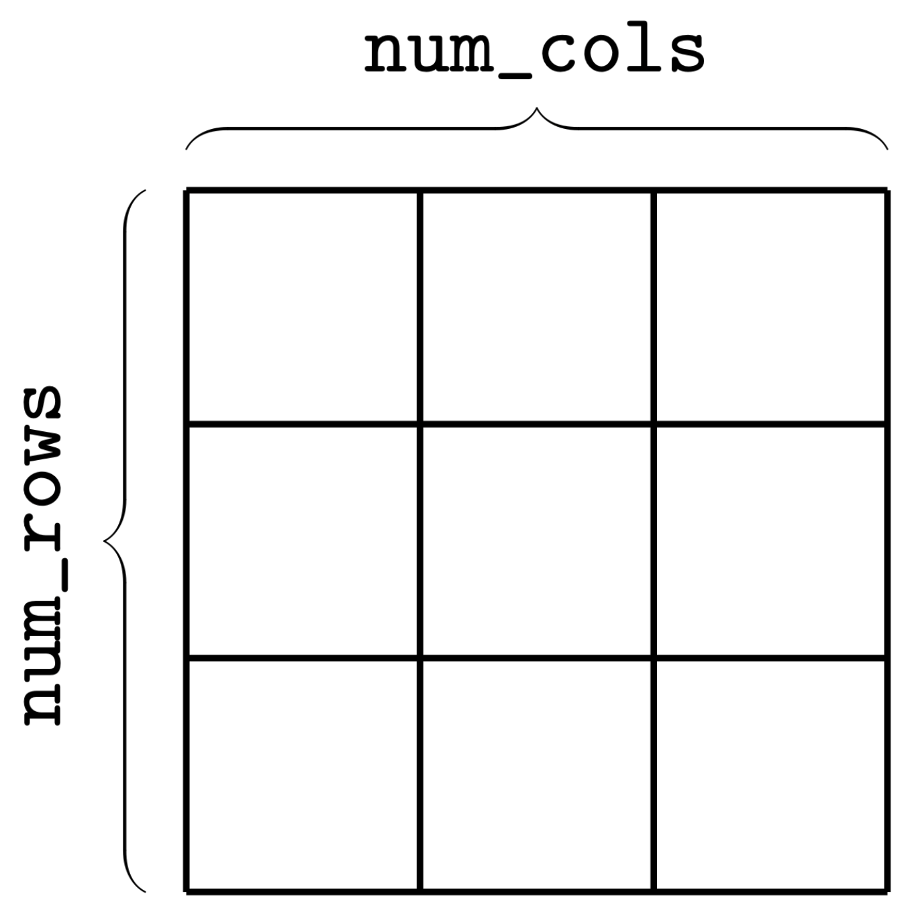
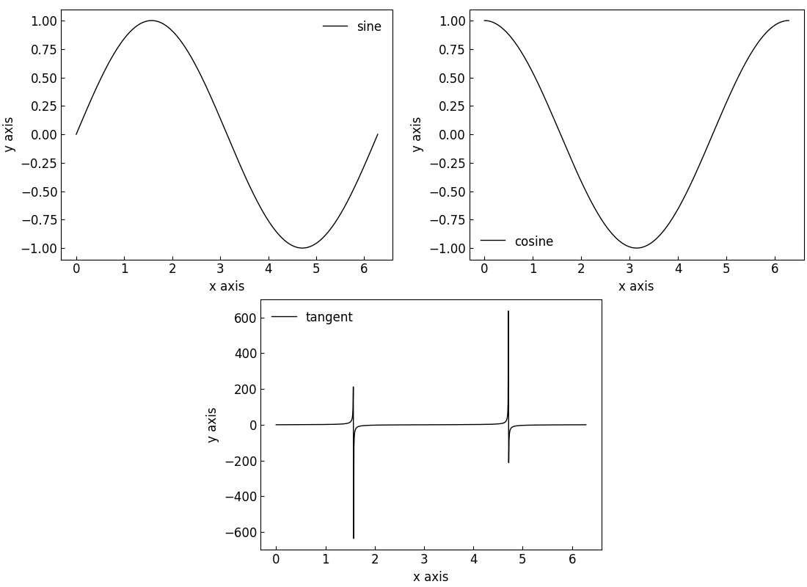
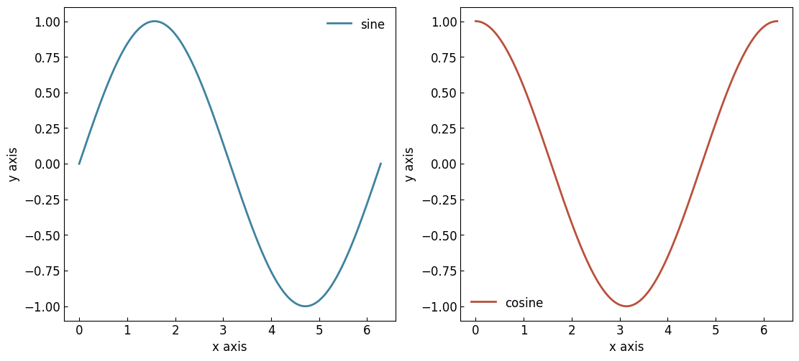
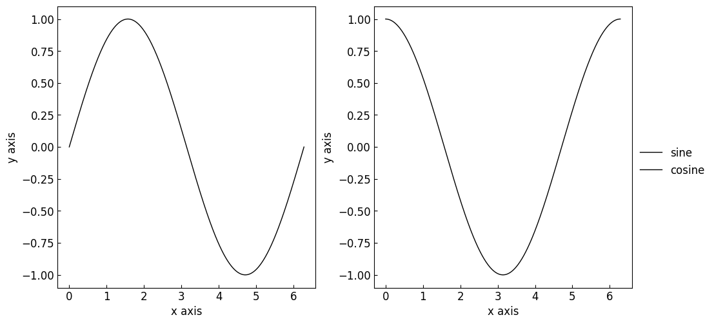

========================================================
Creating a :class:`~graphinglib.multifigure.MultiFigure`
========================================================

To create a :class:`~graphinglib.multifigure.MultiFigure`, you first have to decide what size you want the canvas' grid to be. You control this by setting the values of ``num_rows`` and ``num_cols`` as shown in the figure below. This grid is then used to place each set of axes in the MultiFigure. These values are independent of the size of the canvas.

To create a MultiFigure, simply use the following line of code: ::

    multifigure = gl.MultiFigure(2, 2) # 2 rows, 2 columns

You can add create :class:`~graphinglib.figure.Figure` objects and add them to the :class:`~graphinglib.multifigure.MultiFigure` while specifying its position and size within the grid: ::

    # Create the figures
    figure1 = gl.Figure()
    figure2 = gl.Figure()

    # (row start, column start, rows spanned, columns spanned)
    # This will create a 1x1 SubFigure in the top left corner of the grid
    multifigure.add_sub_figure(figure1, 0, 0, 1, 1)
    # Now we create a SubFigure covering the right column of the grid
    multifigure.add_sub_figure(figure2, 0, 1, 2, 1) # Spans 2 rows, 1 column
    # Bottom left stays empty

Elements can be added to :class:`~graphinglib.figure.Figure` objects as usual using the :py:meth:`~graphinglib.figure.Figure.add_element` method. It is important to note that **a single set of axes is not confined to a single square on the grid; it can span multiple squares.** This means it is possible to align the individual sets of axes however you want. For example, here is how you could insert 3 subfigures in 2 rows with the one on the second row being centered: ::

    import numpy as np
    import graphinglib as gl

    # Create the curves
    sine = gl.Curve.from_function(lambda x: np.sin(x), 0, 2 * np.pi, label="sine")
    cosine = gl.Curve.from_function(lambda x: np.cos(x), 0, 2 * np.pi, label="cosine")
    tangent = gl.Curve.from_function(
        lambda x: np.tan(x), 0, 2 * np.pi, label="tangent", number_of_points=1000
    )

    # Create the figures and add the elements
    figure1 = gl.Figure()
    figure1.add_element(sine)
    figure2 = gl.Figure()
    figure2.add_element(cosine)
    figure3 = gl.Figure()
    figure3.add_element(tangent)

    # Create the MultiFigure and add the figures to it
    multifigure = gl.MultiFigure(2, 4, size=(11, 8)) # 2 rows, 4 columns

    multifigure.add_sub_figure(figure1, 0, 0, 1, 2) # Spans the first 2 columns of the top row
    multifigure.add_sub_figure(figure2, 0, 2, 1, 2) # Spans the last 2 columns of the top row
    multifigure.add_sub_figure(figure3, 1, 1, 1, 2) # Spans the middle 2 columns of the bottom row

    multifigure.display()

As you can see in the above figure, there are labels (a), b), c)) next to each subfigure. These reference labels can be helpful to refer to a specific subfigure when inserting in a document. The boolean parameter ``reference_labels`` (in the :class:`~graphinglib.multifigure.MultiFigure` constructor) can turn these on or off.

Some simple MultiFigure layouts have helper methods to make it easier to create them. For example, you can create a horizontal row or vertical stack of figures using the :py:meth:`~graphinglib.multifigure.MultiFigure.row` or :py:meth:`~graphinglib.multifigure.MultiFigure.stack` classmethods respectively: ::

    multifigure_row = gl.MultiFigure.row([figure1, figure2, figure3], size=(10, 5))
    multifigure_stack = gl.MultiFigure.stack([figure1, figure2, figure3], size=(5, 10))

Legends in MultiFigures
-----------------------

The legends in a MultiFigure can be added separately for every subfigure or as a single legend combining the labels of every plot. This option is controlled by the ``general_legend`` parameter in the :py:meth:`~graphinglib.multifigure.MultiFigure.display` and :py:meth:`~graphinglib.multifigure.MultiFigure.save_figure` methods. By default, it is set to ``False`` so that each subfigure controls its own legend. The two images below illustrate the different legend options.

Styles and Customization in MultiFigures
----------------------------------------

Figure style and customizations can get a bit confusing when working with :class:`~graphinglib.multifigure.MultiFigure` objects. Here is a brief overview:

- The ``figure_style`` chosen in the :class:`~graphinglib.multifigure.MultiFigure` constructor is applied to every :class:`~graphinglib.figure.Figure` in the MultiFigure. Any ``figure_style`` specified in the individual :class:`~graphinglib.figure.Figure` objects is ignored (when displaying or saving the MultiFigure).
- On the other hand, though applying style customizations to the :class:`~graphinglib.multifigure.MultiFigure` object will apply them to every :class:`~graphinglib.figure.Figure` in the MultiFigure, customizations specified in the individual :class:`~graphinglib.figure.Figure` objects is prioritized over the MultiFigure's customizations. This means that turning the grid on in the MultiFigure will turn it on for every :class:`~graphinglib.figure.Figure` in the MultiFigure, but turning it off in an individual :class:`~graphinglib.figure.Figure` will override the MultiFigure's setting and turn it off for that :class:`~graphinglib.figure.Figure` only.

In short, the ``figure_style`` chosen in the :class:`~graphinglib.multifigure.MultiFigure` constructor sets a base style for the MultiFigure as a whole. Calling the :py:meth:`~graphinglib.multifigure.MultiFigure.customize_visual_style` or the :py:meth:`~graphinglib.multifigure.MultiFigure.update_rc_params` methods on the MultiFigure will personalize the chosen ``figure_style`` for the MultiFigure. And calling these methods on the individual :class:`~graphinglib.figure.Figure` objects will alter the MultiFigure's style for that :class:`~graphinglib.figure.Figure` only. Here is an example with customization of the axes edge colors: ::

    import numpy as np

    import graphinglib as gl

    # Create the curves
    sine = gl.Curve.from_function(lambda x: np.sin(x), 0, 2 * np.pi, label="sine")
    cosine = gl.Curve.from_function(lambda x: np.cos(x), 0, 2 * np.pi, label="cosine")

    # Create the figures and add the elements
    figure1 = gl.Figure(figure_style="dark") # this style is ignored when displaying the MultiFigure
    figure1.add_element(sine)
    figure2 = gl.Figure()
    figure2.add_element(cosine)

    # Create the MultiFigure and add the figures to it
    # Use the "plain" style which has a black axes edge color
    multifigure = gl.MultiFigure.row([figure1, figure2], size=(10, 4), figure_style="plain")

    # Customize the axes edge color for all figures (but will be overridden for figure2)
    # Note: order of these calls does not matter, figure2 will always override the MultiFigure
    multifigure.customize_visual_style(axes_edge_color="red")
    figure2.customize_visual_style(axes_edge_color="blue")

    # Display the MultiFigure
    # This will show the two figures side-by-side with the "plain" style, but
    # the axes edge color will be red for figure1 and blue for figure2
    multifigure.display()

    # Display figure1 separately
    # This will show figure1 with the "dark" style
    # No axes edge color customization is applied
    figure1.display()