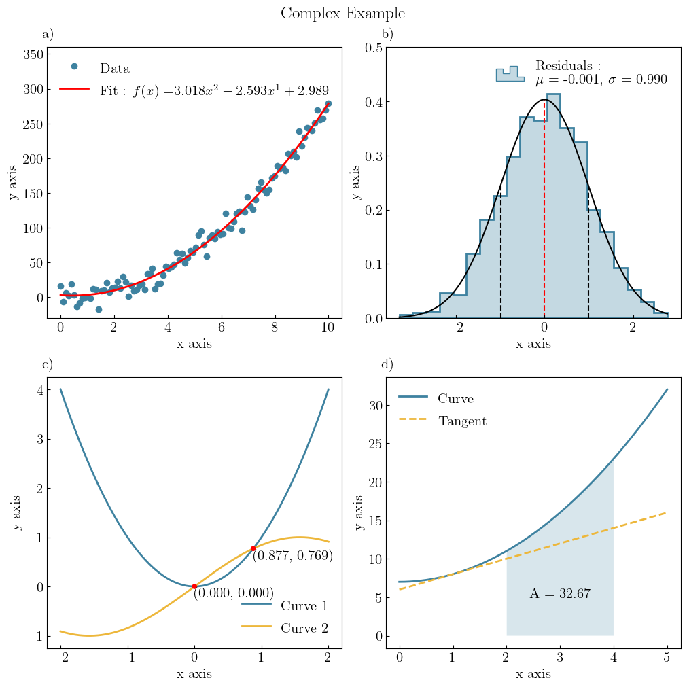

.. _overview:

========
Overview
========

GraphingLib is an object oriented library combining the functionalities of Matplotlib and Scipy. With this library it is possible to create scientific graphs to visualise data while fitting the data with simple, single-line commmands.

GraphingLib also provides the ability to create multiple predefined themes for different applications. Once those themes are specified, they can be applied to figures with a one-word parameter.

Why GraphingLib?
----------------

It is our belief that the best way to explain the simplicity of GraphingLib is by providing an example and so, here is a curve fit calculated and plotted using GraphingLib. ::

    import graphinglib as gl
    import numpy as np

    canvas = gl.MultiFigure(2, 2, (10, 10), title="Complex Example", use_latex=True)

    # Figure 1 - Polynomial curve fit of noisy data

    x_data = np.linspace(0, 10, 100)
    y_data = 3 * x_data**2 - 2 * x_data + np.random.normal(0, 10, 100)
    scatter = gl.Scatter(x_data, y_data, label="Data")
    fit = gl.FitFromPolynomial(scatter, degree=2, label="Fit", color="red")

    fig1 = canvas.add_SubFigure((0, 0, 1, 1), y_lim=(-30, 360))
    fig1.add_element(scatter, fit)

    # Figure 2 - Histogram of random data

    data = np.random.normal(0, 1, 1000)
    hist = gl.Histogram(data, number_of_bins=20, label="Residuals", show_pdf="normal")

    fig2 = canvas.add_SubFigure((0, 1, 1, 1), y_lim=(0, 0.5))
    fig2.add_element(hist)

    # Figure 3 - Intersection of two curves

    curve1 = gl.Curve.from_function(
        lambda x: x**2, x_min=-2, x_max=2, label="Curve 1", color="green"
    )
    curve2 = gl.Curve.from_function(
        lambda x: np.sin(x), x_min=-2, x_max=2, label="Curve 2", color="blue"
    )
    intersection_points = curve1.intersection(curve2, colors="red")

    for point in intersection_points:
        point.add_coordinates()
        point.h_align = "left"
        point.v_align = "top"

    fig3 = canvas.add_SubFigure((1, 0, 1, 1))
    fig3.add_element(curve1, curve2, *intersection_points)

    # Figure 4 - Integral of a curve between two points and tangent line

    curve = gl.Curve.from_function(lambda x: x**2 + 7, x_min=0, x_max=5, label="Curve")
    area = curve.area_between(2, 4, fill_under=True)
    tangent = curve.get_tangent_curve(1, label="Tangent", color="orange", line_style="--")
    area_text = gl.Text(3, 5, "A = {:.2f}".format(area), color="k")

    fig4 = canvas.add_SubFigure((1, 1, 1, 1))
    fig4.add_element(curve, tangent, area_text)

    # canvas.save_figure("complex_example.png", legend=False)
    canvas.display(legend=False)

