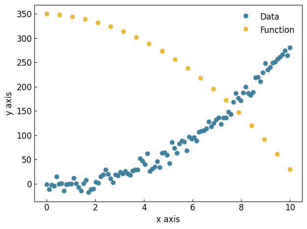
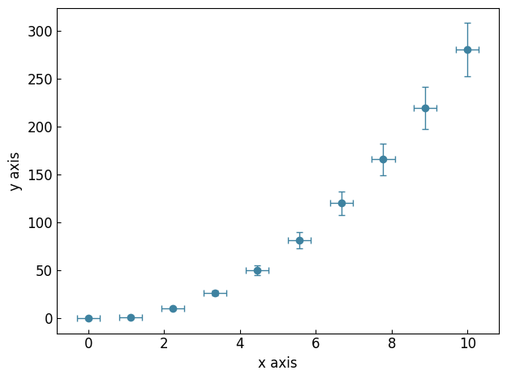
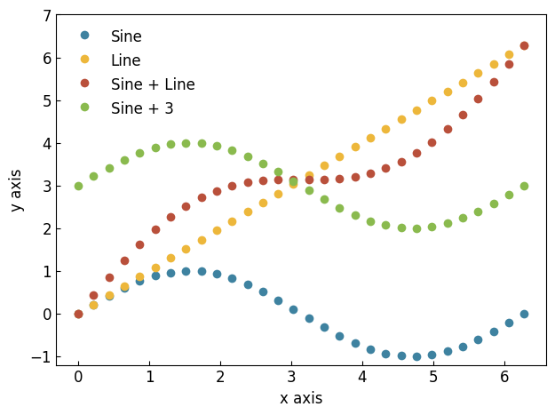
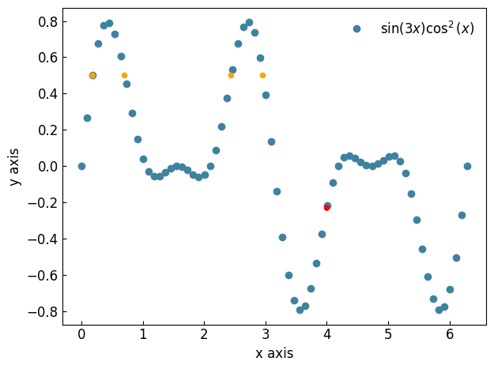
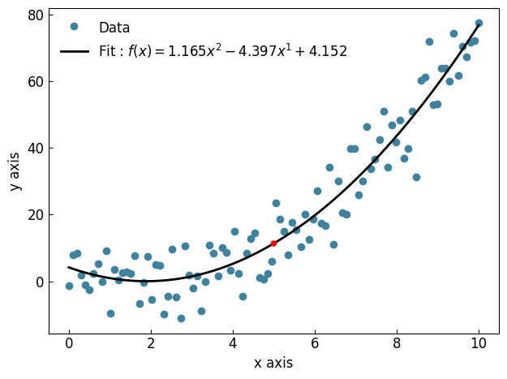
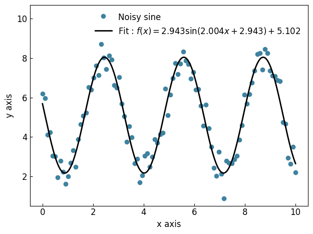
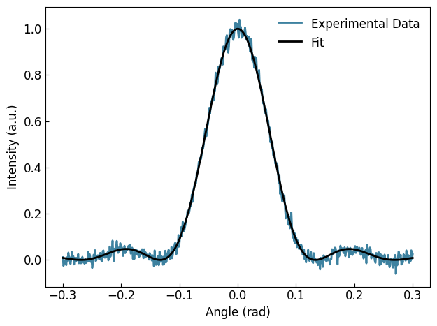

===========================================
Scatter plots and fitting experimental data
===========================================

The :class:`~graphinglib.data_plotting_1d.Scatter` Object
---------------------------------------------------------

In GraphingLib, there are two ways to create a :class:`~graphinglib.data_plotting_1d.Scatter` object. If you want to plot existing data, you can use the standard constructor by passing in the x and y data as lists or numpy arrays. If you want to plot a function, you can use the :meth:`~graphinglib.data_plotting_1d.Scatter.from_function` method. This method takes in a function and a range of x values to evaluate the function at. In the latter case, you can also specify the number of points to evaluate the function at. Both of these alternatives are shown below.

.. code-block:: python

    import graphinglib as gl
    import numpy as np

    # Create data
    x_data = np.linspace(0, 10, 100)
    y_data = 3 * x_data**2 - 2 * x_data + np.random.normal(0, 10, 100)

    # Create scatter plot from data
    scatter_1 = gl.Scatter(x_data, y_data, label="Data")

    # Create scatter plot from function
    scatter_2 = gl.Scatter.from_function(
        lambda x: -3 * x**2 - 2 * x + 350,
        x_min=0,
        x_max=10,
        number_of_points=20,
        label="Function",
    )

    # Create figure and display
    fig = gl.Figure()
    fig.add_element(scatter_1, scatter_2)
    fig.display()

You can also add error bars for `x` and/or `y` by calling the :meth:`~graphinglib.data_plotting_1d.Scatter.add_errorbars` method like so:

.. code-block:: python

    # Create data
    x_data = np.linspace(0, 10, 10)
    y_data = 3 * x_data**2 - 2 * x_data

    # Add errorbars with float or array/list of floats
    scatter = gl.Scatter(x_data, y_data)
    scatter.add_errorbars(x_error=0.3, y_error=0.1 * y_data)

Just like with the :class:`~graphinglib.data_plotting_1d.Curve` object, you can add, subtract, multiply, and divide two :class:`~graphinglib.data_plotting_1d.Scatter` objects. You can also add, subtract, multiply, and divide a :class:`~graphinglib.data_plotting_1d.Scatter` object by a float or int.

.. warning ::
    If you add, subtract, multiply, or divide two :class:`~graphinglib.data_plotting_1d.Scatter` objects, the two objects must have the same x values. If they do not, an exception will be raised.

.. code-block:: python

    scatter_sine = gl.Scatter.from_function(
        lambda x: np.sin(x), x_min=0, x_max=2 * np.pi, label="Sine"
    )

    scatter_line = gl.Scatter.from_function(
        lambda x: x, x_min=0, x_max=2 * np.pi, label="Line"
    )

    scatter_addition = scatter_sine + scatter_line
    scatter_addition.label = "Sine + Line"

    scatter_plus_constant = scatter_sine + 3
    scatter_plus_constant.label = "Sine + 3"

Interpolation between data points is possible by calling the :meth:`~graphinglib.data_plotting_1d.Scatter.get_coordinates_at_x` and :meth:`~graphinglib.data_plotting_1d.Scatter.get_coordinates_at_y` methods. The first returns a tuple of coordinates that represent the point on the curve at the specified x value. The second works the same way, but returns a list of tuples, one for each point on the curve that has the specified y value. The :meth:`~graphinglib.data_plotting_1d.Scatter.create_point_at_x` and :meth:`~graphinglib.data_plotting_1d.Scatter.create_points_at_y` methods work the same way, but return :class:`~graphinglib.graph_elements.Point` objects instead of tuples.

.. code-block:: python

    scatter = gl.Scatter.from_function(
        lambda x: np.sin(3 * x) * np.cos(x) ** 2,
        x_min=0,
        x_max=2 * np.pi,
        number_of_points=70,
        label="$\sin(3x)\cos^2(x)$",
    )

    point_at_4 = scatter.create_point_at_x(4, color="red")
    points_at_y_one_half = scatter.create_points_at_y(0.5, color="orange")

    fig = gl.Figure()
    # Use the * operator to unpack the list of points
    fig.add_element(scatter, point_at_4, *points_at_y_one_half)
    fig.display()

Curve fitting
-------------

There are a number of curve fit objects that can be used to fit data. The most versatile is the :class:`~graphinglib.fits.FitFromFunction` object. This object takes in a function and a :class:`~graphinglib.data_plotting_1d.Scatter` or :class:`~graphinglib.data_plotting_1d.Curve` object and fits the data to the function. However, the most common functions have their own dedicated fit objects to accelerate the fitting process. The most powerful of these is the :class:`~graphinglib.fits.FitFromPolynomial` object. All you need to do is pass in a :class:`~graphinglib.data_plotting_1d.Scatter` object and the degree of the polynomial you want to fit to the data:

.. code-block:: python

    # Create noisy data
    x = np.linspace(0, 10, 100)
    y = x**2 - 3 * x + 3 + np.random.normal(0, 7, 100)

    scatter = gl.Scatter(x, y, "Data")
    fit = gl.FitFromPolynomial(scatter, 2, "Fit")

    # Print the coefficients of the fit
    coefficients = fit.coeffs
    for i, c in enumerate(coefficients):
        print(f"Coefficient of x^{i}: {c}")

    # Use the fit to predict value of y at x = 5
    print(f"Value of fit at x = 5 is y = {fit.function(5)}")
    predicted_point = fit.create_point_at_x(5, color="red")

    fig = gl.Figure()
    fig.add_element(scatter, fit, predicted_point)
    fig.display()

.. code-block:: none
    
    Coefficient of x^0: 4.9668661552059294
    Coefficient of x^1: -4.099977593163963
    Coefficient of x^2: 1.0770659002222067
    Value of fit at x = 5 is y = 11.39362569494128

Currently, the following fit objects are available:
- :class:`~graphinglib.fits.FitFromPolynomial`
- :class:`~graphinglib.fits.FitFromExponential`
- :class:`~graphinglib.fits.FitFromLog`
- :class:`~graphinglib.fits.FitFromSquareRoot`
- :class:`~graphinglib.fits.FitFromSine`
- :class:`~graphinglib.fits.FitFromGaussian`

The details of how to use each of these fit objects, as well as the specific variables that are fitted (and how to access them), are described in the API Reference. For some of these, it can be useful to specify initial guesses for the fitted variables with the `guesses` argument.

Here is an example of fitting a sine function to some data:

.. code-block:: python

    import graphinglib as gl
    import numpy as np

    # Create noisy sine wave data
    x = np.linspace(0, 10, 100)
    y = 3 * np.sin(2 * x + 3) + 5 + np.random.normal(0, 0.5, 100)

    # Create scatter plot and fit with guesses (amplitude, frequency, phase, offset)
    # Frequency is the most important parameter to get close to the actual value
    scatter = gl.Scatter(x, y, label="Noisy sine")
    fit = gl.FitFromSine(scatter, label="Fit", guesses=(1, 2.2, 1, 1))
    all_params = fit.get_parameters()
    print(f"Amplitude: {fit.amplitude:.3f}")
    print(f"Frequency: {fit.frequency_rad:.3f}")
    print(f"Phase: {fit.phase_rad:.3f}")
    print(f"Vertical shift: {fit.vertical_shift:.3f}")

    fig = gl.Figure(y_lim=(0.5, 10.7))
    fig.add_element(scatter, fit)
    fig.display()

.. code-block:: none

    Amplitude: 2.943
    Frequency: 2.004
    Phase: 2.943
    Vertical shift: 5.102

And here is an example of fitting a specific, user-defined function to some data. In this example, a laser of wavelength 532 nm is shone though a single slit of unknown width. The resulting diffraction pattern is recorded on a screen. You can use the Fraunhofer single-slit diffraction equation to fit the data and determine the width of the slit:

.. code-block:: python

    import graphinglib as gl
    import numpy as np

    def single_slit(theta, a):
        wavelength = 500e-9
        beta = np.pi * a * np.sin(theta) / wavelength
        return (np.sinc(beta / np.pi)) ** 2

    # Our fictional experimental data (with noise and slit width of 3.75 microns)
    theta = np.linspace(-0.3, 0.3, 500)
    a = 3.75e-6
    I_exp = single_slit(theta, a) + np.random.normal(0, 0.02, 500)

    # Create scatter and fit from single_slit function
    scatter = gl.Curve(theta, I_exp, label="Experimental Data")
    fit = gl.FitFromFunction(single_slit, scatter, label="Fit", guesses=(1e-6))

    # Fitted parameters are stored in the Fit object
    print(f"Slit width: {fit.parameters[0] * 1e6:.3f} microns")

    fig = gl.Figure(x_label="Angle (rad)", y_label="Intensity (a.u.)")
    fig.add_element(scatter, fit)
    fig.display()

.. code-block:: none

    Slit width: 3.763 microns

