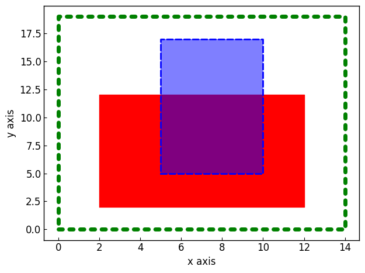
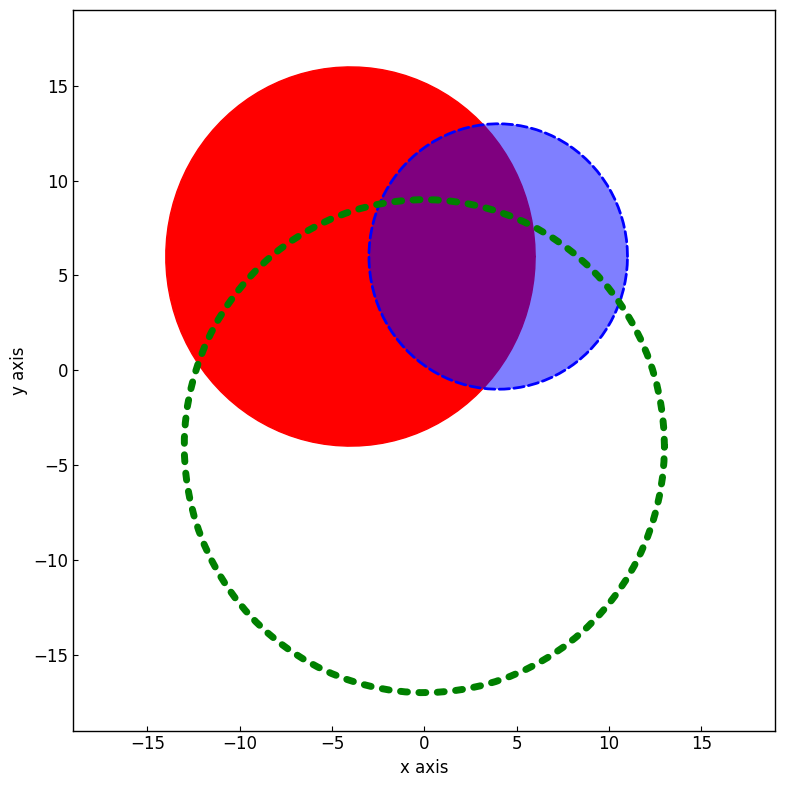
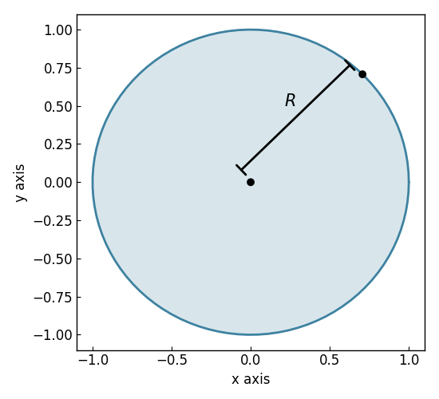

===============
Creating Shapes
===============

The :class:`~graphinglib.shapes.Rectangle` Object
-------------------------------------------------

You can draw rectangles easily by creating an instance of the :class:`~graphinglib.shapes.Rectangle` class as shown below: ::

    import graphinglib as gl

    # Create a Rectangle from the bottom left corner
    rect = gl.Rectangle(x_bottom_left=0, y_bottom_left=0, width=10, height=10)

    # Create a Rectangle from its center
    rect2 = gl.Rectangle.from_center(x=0, y=0, width=10, height=10)

    # Create a Rectangle from two opposite corner points
    point1 = gl.Point(0,0)
    point2 = gl.Point(10,10)
    rect3 = gl.Rectangle.from_points(point1, point2)

You can customize the appearance of Rectangles by specifying the following optional parameters: ``color``, ``line_width``, ``line_style``, ``fill`` (True or False), and ``fill_alpha``. Here is an example with different styles of Rectangles: ::

    import graphinglib as gl

    rect1 = gl.Rectangle(
        x_bottom_left=2,
        y_bottom_left=2,
        width=10,
        height=10,
        color="red",
        line_width=1,
        line_style="solid",
        fill=True,
        fill_alpha=1,
    )

    rect2 = gl.Rectangle(
        x_bottom_left=5,
        y_bottom_left=5,
        width=5,
        height=12,
        color="blue",
        line_width=2,
        line_style="dashed",
        fill=True,
        fill_alpha=0.5,
    )

    rect3 = gl.Rectangle(
        x_bottom_left=0,
        y_bottom_left=0,
        width=14,
        height=19,
        color="green",
        line_width=5,
        line_style="dotted",
        fill=False,
    )

    figure = gl.Figure()
    figure.add_element(rect1, rect2, rect3)
    figure.display()

There are many useful methods which can be used with Rectangles. For example, you can check if a point is inside a Rectangle: ::

    import graphinglib as gl

    rect = gl.Rectangle(x_bottom_left=0, y_bottom_left=0, width=10, height=10)
    point = gl.Point(5, 5)

    print(point in rect)  # True

You can get the area and perimeter of a Rectangle: ::

    import graphinglib as gl

    rect = gl.Rectangle(x_bottom_left=0, y_bottom_left=0, width=10, height=10)

    print(rect.get_area())  # 100
    print(rect.get_perimeter())  # 40

You can also get Point objects or coordinates out of a Rectangle, like the center point, or the two points at a given x or y value: ::

    import graphinglib as gl

    rect = gl.Rectangle(x_bottom_left=0, y_bottom_left=0, width=10, height=10)

    point_center = rect.create_center_point()
    coordinates_center = rect.get_center_coordinates()

    point1, point2 = rect.get_points_at_x(5)
    coords1, coords2 = rect.get_coordinates_at_x(5)

The :class:`~graphinglib.shapes.Circle` Object
-----------------------------------------------

GraphingLib also lets you plot Circles. You can create a Circle by specifying its center point and radius: ::

    import graphinglib as gl

    circle = gl.Circle(x_center=0, y_center=0, radius=10)

You can customize the appearance of Circles by specifying the following optional parameters: ``color``, ``line_width``, ``line_style``, ``fill`` (True or False), and ``fill_alpha``. Here is an example with different styles of Circles: ::

    import graphinglib as gl

    circle1 = gl.Circle(
        x_center=-4,
        y_center=6,
        radius=10,
        color="red",
        line_width=1,
        line_style="solid",
        fill=True,
        fill_alpha=1,
    )

    circle2 = gl.Circle(
        x_center=4,
        y_center=6,
        radius=7,
        color="blue",
        line_width=2,
        line_style="dashed",
        fill=True,
        fill_alpha=0.5,
    )

    circle3 = gl.Circle(
        x_center=0,
        y_center=-4,
        radius=13,
        color="green",
        line_width=5,
        line_style="dotted",
        fill=False,
    )

    # Figure size and axis limits are set to make the circles look round
    figure = gl.Figure(x_lim=(-19, 19), y_lim=(-19, 19), size=(8, 8))
    figure.add_element(circle1, circle2, circle3)
    figure.display()

As with Rectangles, there are also many useful methods which can be used with Circles. Here are some examples: ::

    import graphinglib as gl

    circle = gl.Circle(x_center=0, y_center=0, radius=1)

    print(circle.get_area()) # 3.141592653589793
    print(circle.get_circumference()) # 6.283185307179586

    point = gl.Point(5, 5)
    print(point in circle)  # False

You can also get Point objects and coordinates out of a Circle like so: ::

    import graphinglib as gl

    circle = gl.Circle(x_center=0, y_center=0, radius=1)

    # Get the center point
    point_center = circle.create_center_point()

    # Get the coordinates at a certain x value
    point1, point2 = circle.get_coordinates_at_x(0)

    # Get the point on the circle at a given angle
    point = circle.create_point_at_angle(45, degrees=True)

The :class:`~graphinglib.shapes.Arrow` Object
----------------------------------------------

GraphingLib also lets you plot Arrows. You can create an Arrow by specifying its start and end points: ::

    import graphinglib as gl

    arrow = gl.Arrow(pointA=(0, 0), pointB=(10, 10))

You can customize the appearance of Arrows by specifying the following optional parameters: ``color``, ``width`` (the line width), ``head_size``, ``two_sided`` (True or False), and ``shrink``. The ``shrink`` parameter is a float between 0 and 0.5 which shortens the arrow from both ends by the given percentage (0 doesn't shrink at all, 0.5 makes the arrow disappear completely). Here is an example with different styles of Arrows: ::

    import graphinglib as gl

    arrow1 = gl.Arrow(
        pointA=(0, 0),
        pointB=(1, 1),
        color="red",
        shrink=0,  # default, no shrinking
    )
    arrow2 = gl.Arrow(
        pointA=(1, 0),
        pointB=(2, 1),
        color="blue",
        shrink=0.05,
        two_sided=True,
        head_size=3,
    )
    arrow3 = gl.Arrow(
        pointA=(2, 0),
        pointB=(3, 1),
        color="green",
        shrink=0.2,
        two_sided=True,
        width=4,
    )

    # Create points at the start and end of the arrows (to illustrate the shrinking)
    point1 = gl.Point(0, 0, color="red")
    point2 = gl.Point(1, 0, color="blue")
    point3 = gl.Point(2, 0, color="green")
    point4 = gl.Point(1, 1, color="red")
    point5 = gl.Point(2, 1, color="blue")
    point6 = gl.Point(3, 1, color="green")

    fig = gl.Figure(y_lim=(-0.5, 1.5), x_lim=(-0.5, 3.5))
    fig.add_element(arrow1, arrow2, arrow3)
    fig.add_element(point1, point2, point3)
    fig.add_element(point4, point5, point6)
    fig.display()

.. image:: images/arrow.png

The :class:`~graphinglib.shapes.Line` object
--------------------------------------------

It is possible to add lines to figures. Similarly to the :class:`~graphinglib.shapes.Arrow` object, simply specify the two end points::

    import graphinglib as gl

    line = gl.Line((0, 0), (1, 1))

It is possible to change the width of the line with the ``width`` parameter. The ``capped_line`` parameter allows you to add perpendicular caps to both ends of the line. The width of those caps can be controlled with the ``cap_width`` parameter::

    import graphinglib as gl

    # Creating a circle and finding a point at 45 degrees on the circumference
    circle = gl.Circle(0, 0, 1, line_width=2)
    center = gl.Point(0, 0, marker_size=50)
    point = circle.get_point_at_angle(45, True, True)
    point.marker_size = 50
    
    # Adding a line to display the radius of the circle
    line = gl.Line(
        (-0.07, 0.07), (point.x - 0.07, point.y + 0.07), capped_line=True, cap_width=1
    )
    text = gl.Text(0.25, 0.5, r"$R$", font_size=15)

    # Display the elements
    fig = gl.Figure(size=(5.5, 5))
    fig.add_element(circle, point, line, center, text)
    fig.display()

