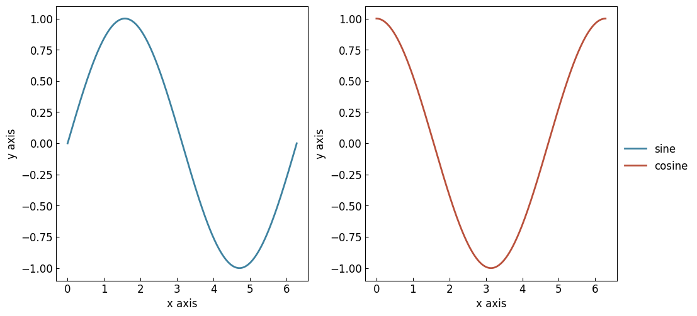

===================================================================
Creating a simple figure with the :class:`~graphinglib.SmartFigure`
===================================================================

Quickstart
----------

Creating a basic figure using the :class:`~graphinglib.SmartFigure` object is easy. The example below shows how to create a sine curve and display it.

.. plot::
    :context:

    sine = gl.Curve.from_function(lambda x: np.sin(x), 0, 2 * np.pi)

    figure = gl.SmartFigure(elements=[sine])
    figure.show()

The :py:meth:`~graphinglib.SmartFigure.show` method is used to show the figure on screen. It is also possible to use the :py:meth:`~graphinglib.SmartFigure.save` method to save the figure to a specified path while setting certain options like the resolution (dpi).

.. seealso::

    For the documentation on the :py:meth:`~graphinglib.Curve.from_function` method, see the :doc:`handbook section on curves </handbook/curve>`.

We can specify the axis labels by using the ``x_label`` and ``y_label`` parameters of the :class:`~graphinglib.SmartFigure`.

.. plot::
    :context: close-figs

    figure = gl.SmartFigure(x_label="Time (s)", y_label="Potential (V)", elements=[sine])
    figure.show()

As a general note, all parameters available in the constructor are also available as properties. This means that you can set or modify them after creating the :class:`~graphinglib.SmartFigure`. For further informations on the available parameters and methods, please refer to the :doc:`handbook section on complex SmartFigures </handbook/smart_figure_advanced>` or the :doc:`reference section on SmartFigure objects <../generated/graphinglib.SmartFigure>`.

Creating multi-subplots layouts
-------------------------------

To create a figure with a grid of subplots, the dimensions of the canvas first need to be defined using the ``num_rows`` and ``num_cols`` parameters, shown in the figure below. This grid is then used to place each subplot in the :class:`~graphinglib.SmartFigure`.

.. image:: images/Canvas.png
    :scale: 30%
    :align: center
    :class: margin-bottom

For example, let's create a :class:`~graphinglib.SmartFigure` with 2 rows, 3 columns and 6 random curves:

.. plot::
    :context: close-figs

    random_curve = lambda: gl.Curve.from_function(
        lambda x: np.random.rand() * np.sin(x), 0, 2*np.pi
    )
    figure = gl.SmartFigure(2, 3, elements=[random_curve() for _ in range(6)])
    figure.show()

It is also possible to add elements to a preexisting figure using the :py:meth:`~graphinglib.SmartFigure.add_elements` method:

.. plot::
    :context: close-figs

    figure.add_elements(*[random_curve() for _ in range(3)])  # Adds to the top subplots
    figure.show()

The :py:meth:`~graphinglib.SmartFigure.__setitem__` method can also be used to add or remove elements from specific subplots by specifying their position in the grid, exactly how `two-dimensional numpy arrays are indexed <https://numpy.org/doc/stable/user/basics.indexing.html>`_. Attributing ``None`` to a subplot will remove all its elements. Slicing is also supported to add elements to or remove elements from multiples rows or coklumns at once. Here are some examples:

.. plot::
    :context: close-figs

    # Remove the elements from the bottom row
    figure[1, 0] = None
    figure[1, 1] = None
    figure[1, 2] = None

    # Add a curve that spans the last two subplots of the bottom row
    figure[1, 1:] = random_curve()

    # Add a curve to the second suplot
    figure[0, 1] += [random_curve()]

    figure.show()

The advantage of the :class:`~graphinglib.SmartFigure` class is that you can insert this object in itself:

.. plot::
    :context: close-figs

    # Insert the previous figure in the second subplot of the first row
    figure[1, 1:] = figure.copy()
    figure.show()

When inserting a :class:`~graphinglib.SmartFigure` into another :class:`~graphinglib.SmartFigure`, all the parameters of the nested :class:`~graphinglib.SmartFigure` (like axis labels, title, styles, etc.) will be applied to all its subplots. This means that complex figures with different sets of parameters per subplot can be created by nesting :class:`~graphinglib.SmartFigure` objects.

In the previous examples, there were labels a), b), c), ... at the top left corner of each subplot. These labels are refered to as **reference labels** and are useful to identify each subplot when inserting the figure in a document. The boolean parameter ``reference_labels`` (in the :class:`~graphinglib.SmartFigure` constructor or as a property) can turn these on or off.

Legends in SmartFigures
-----------------------

Legends in SmartFigures can be toggled with the ``show_legend`` parameter which applies to all subplots in the :class:`~graphinglib.SmartFigure`. However, it does not apply to nested :class:`~graphinglib.SmartFigure` objects, which allows them to control their own legends independently. The legends in a :class:`~graphinglib.SmartFigure` can be added separately for every subplot or as a single legend combining the labels of every plot. This option is controlled by the ``general_legend`` parameter. By default, it is set to ``False`` so that each subfigure controls its own legend. The two images below illustrate the different legend options. Note that it is also possible to control the position of the legend using the ``legend_loc`` parameter.

.. image:: images/individuallegend.png
    :class: margin-bottom

Figure styles
-------------

The ``figure_style`` parameter of the :class:`~graphinglib.SmartFigure` class allows you to specify a predefined style to use to change the appearance of the figure and the elements plotted inside it. You can specify a predefined style as follows:

.. plot::

    figure = gl.SmartFigure(x_label="Time (s)", y_label="Potential (V)", figure_style="plain")

There are 3 categories of predefined styles.

- GraphingLib styles are styles that we have created and that are always available. The default style called "plain" is one of these, and you can see the others :ref:`here <graphinglib_styles_showcase>`.
- All Matplotlib styles are also available. You can see the list of available Matplotlib styles `here <https://matplotlib.org/stable/gallery/style_sheets/style_sheets_reference.html>`_. To use the default Matplotlib style, simply specify ``"matplotlib"`` as the style.
- You can also create, save and specify your own custom styles, and you can even set your preferred style as the default style.

It is important to note that the parameters controlled by the specified style can be overridden simply by specifying the desired options. **The explicitly specified options will always be prioritized.**

.. seealso:: For the instructions on how to write your own figure style file and see what parameters are controlled by the figure style files, see :doc:`/handbook/figure_style_file`.

Style customization
-------------------

Besides the ``figure_style`` parameter, it is possible to further customize a figure's appearance by using the :py:meth:`~graphinglib.SmartFigure.set_visual_params` or the :py:meth:`~graphinglib.SmartFigure.set_rc_params` methods. The first method allows you to specify the options directly, while the second method allows you to specify the options using a dictionary of `matplotlib rc parameters <https://matplotlib.org/stable/users/explain/customizing.html>`_. Only the most common options are available using the first method, while the second method allows you to give any `matplotlib rc parameter <https://matplotlib.org/stable/users/explain/customizing.html>`_. Here is an example using the first method:

.. plot::

    figure = gl.SmartFigure(x_label="Time (s)", y_label="Potential (V)", figure_style="plain")
    figure.set_visual_params(
        use_latex=True,
        font_size=12,
        axes_edge_color="red",
    )

And here is another example for the second method:

.. plot::

    figure = gl.SmartFigure(x_label="Time (s)", y_label="Potential (V)", figure_style="plain")
    figure.set_rc_params(
        {
            "text.usetex": True,
            "font.size": 12,
            "axes.edgecolor": "red",
        }
    )

Both work fine, but the first method allows to take advantage of the power of your IDE's popup suggestions and saves the user from having to look up the `matplotlib rc parameter <https://matplotlib.org/stable/users/explain/customizing.html>`_ names for the most common options.

.. note:: If you find yourself using the same options over and over again, you may want to create your own figure style file. It's much easier than it sounds and will save you a lot of time! See :doc:`/handbook/figure_style_file` for more information.

Styles and customization with nested SmartFigures
-------------------------------------------------

Figure style and customizations can get a bit confusing when working with nested :class:`~graphinglib.SmartFigure` objects. Here is a brief overview:

- The ``figure_style`` parameter of the parent is applied to every nested :class:`~graphinglib.SmartFigure` in it. Any ``figure_style`` specified in the nested :class:`~graphinglib.SmartFigure` objects is ignored.
- On the other hand, though applying style customizations to the :class:`~graphinglib.SmartFigure` object will apply them to every nested :class:`~graphinglib.SmartFigure`, customizations specified in the individual nested :class:`~graphinglib.SmartFigure` objects are prioritized over the parent :class:`~graphinglib.SmartFigure`'s customizations. For example, this means that turning the grid on in the :class:`~graphinglib.SmartFigure` will turn it on for every nested :class:`~graphinglib.SmartFigure` objects, but turning it off in an individual :class:`~graphinglib.SmartFigure` will override the parent :class:`~graphinglib.SmartFigure`'s setting and turn it off for that nested :class:`~graphinglib.SmartFigure` only.

In short, the ``figure_style`` chosen in a parent :class:`~graphinglib.SmartFigure` sets a base style for the :class:`~graphinglib.SmartFigure` as a whole. Calling the :py:meth:`~graphinglib.SmartFigure.set_visual_params` or the :py:meth:`~graphinglib.SmartFigure.set_rc_params` methods on the :class:`~graphinglib.SmartFigure` will personalize the chosen ``figure_style``, whereas calling these methods on the individual nested :class:`~graphinglib.SmartFigure` objects only allows them to override the parent :class:`~graphinglib.SmartFigure`'s customizations. Here is an example with customization of the axes edge colors:

.. plot::

    # Create the curves
    sine = gl.Curve.from_function(lambda x: np.sin(x), 0, 2 * np.pi, label="sine")
    cosine = gl.Curve.from_function(lambda x: np.cos(x), 0, 2 * np.pi, label="cosine")

    # Create the figures and add the elements
    figure1 = gl.SmartFigure(figure_style="dark")
    figure1.add_elements(sine)
    figure2 = gl.SmartFigure(elements=[cosine])

    # Create the parent SmartFigure and add the figures to it
    # Use the "plain" style which has a black axes edge color
    parent_figure = gl.SmartFigure(num_cols=2, size=(10, 4), figure_style="plain")
    parent_figure.elements = [figure1, figure2]

    # Customize the axes edge color for all figures (but will be overridden for figure2)
    # Note: the order of these calls does not matter,
    # a nested SmartFigure will always override the parent SmartFigure
    parent_figure.set_visual_params(axes_edge_color="red")
    figure2.set_visual_params(axes_edge_color="blue")

    # Display the parent SmartFigure
    # This shows the two figures side-by-side with the "plain" style, but
    # the axes edge color will be red for figure1 and blue for figure2
    parent_figure.show()

    # Display figure1 separately
    # This shows figure1 with the "dark" style and with no axes edge color customization
    figure1.show()
