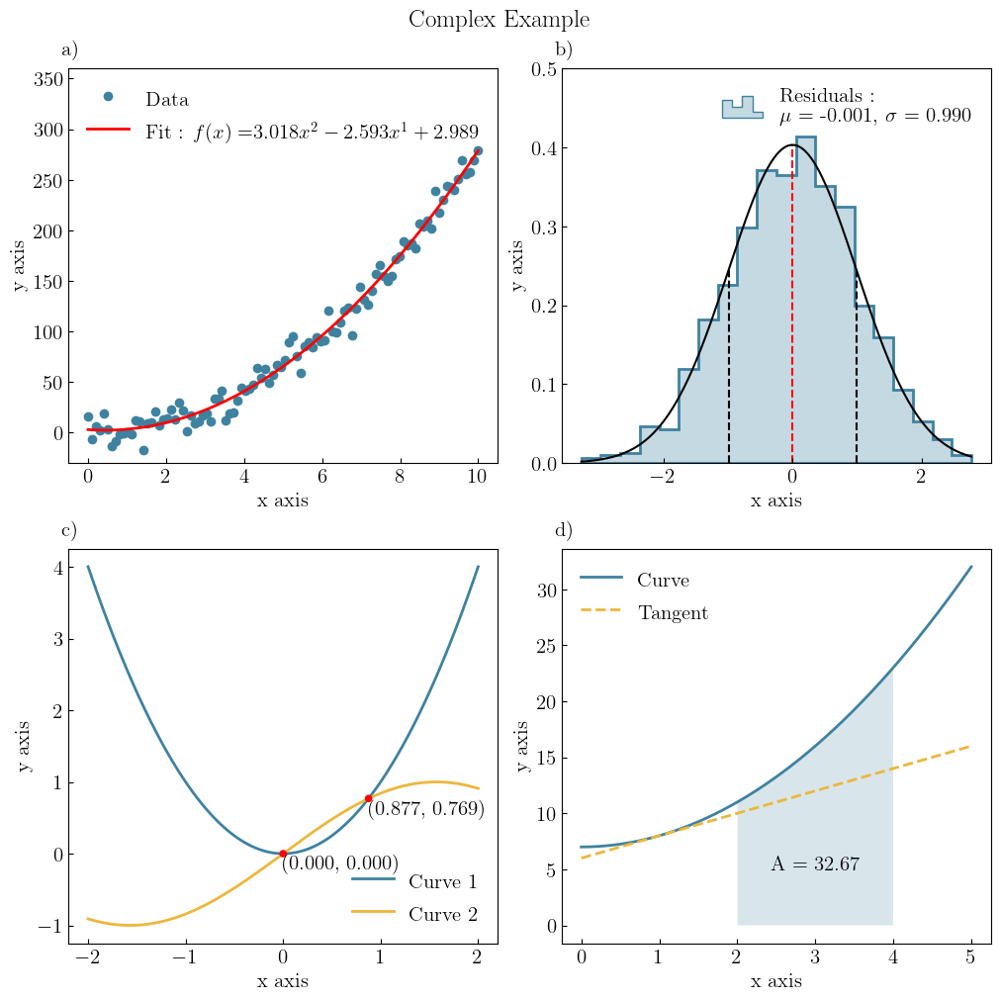
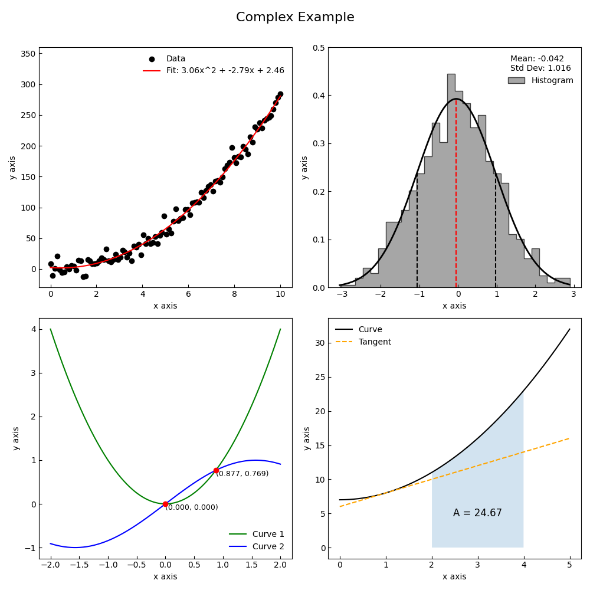

:html_theme.sidebar_secondary.remove:

.. grid:: 1 1 2 2
   :gutter: 3

   .. grid-item::
      :child-align: center

      .. div:: sd-fs-1 sd-pb-0
         
         GraphingLib |release| Documentation
        
      .. div:: sd-pt-0 sd-pb-4
            
         A Python library for creating publication-quality figures with ease.
         
      .. button-ref:: examples/index
         :color: primary

         Go to Gallery
    
   .. grid-item::

        .. raw:: html

            

            

                

                    
                

                

                    
                

                

                    
                

                

                    
                

                

                    
                

                

                    
                

            

            
      

.. grid:: 1 1 3 3

    .. grid-item-card::
        :img-top: _static/icons//index_getting_started.svg

        Getting started
        ^^^^^^^^^^^^^^^
        If you are new to GraphingLib, check out this section first to learn how to install and import GraphingLib.
        ++++
        
        .. button-ref:: installation
            :expand:
            :color: primary
            :click-parent:

            Get started
    
    .. grid-item-card::
        :img-top: _static/icons/index_user_guide.svg

        Handbook
        ^^^^^^^^
        Once GraphingLib is installed, visit this section to learn how to use its different features.
        ++++

        .. button-ref:: handbook/index
            :expand:
            :color: primary
            :click-parent:

            Visit the Handbook
        
    .. grid-item-card::
        :img-top: _static/icons/index_api.svg
        
        Reference
        ^^^^^^^^^
        If you are looking for more details on objects and their methods, visit this section.
        ++++

        .. button-ref:: release_notes/index
            :expand:
            :color: primary
            :click-parent:

            Visit the API Reference

Why GraphingLib?
----------------

For most data science applications, GraphingLib can provide a much more concise and intuitive coding experience than existing libraries. It is our belief that the best way to explain the simplicity and beauty of GraphingLib is by providing an example, so here is a complex figure obtained in just 53 lines using GraphingLib. ::

    import graphinglib as gl
    import numpy as np

    # Figure 1 - Polynomial curve fit of noisy data

    x_data = np.linspace(0, 10, 100)
    y_data = 3 * x_data**2 - 2 * x_data + np.random.normal(0, 10, 100)
    scatter = gl.Scatter(x_data, y_data, label="Data")
    fit = gl.FitFromPolynomial(scatter, degree=2, label="Fit", color="red")

    fig1 = gl.Figure(y_lim=(-30, 360))
    fig1.add_elements(scatter, fit)

    # Figure 2 - Histogram of random data

    data = np.random.normal(0, 1, 1000)
    hist = gl.Histogram(data, number_of_bins=20, label="Residuals")
    hist.add_pdf()

    fig2 = gl.Figure(y_lim=(0, 0.5))
    fig2.add_elements(hist)

    # Figure 3 - Intersection of two curves

    curve1 = gl.Curve.from_function(lambda x: x**2, x_min=-2, x_max=2, label="Curve 1")
    curve2 = gl.Curve.from_function(lambda x: np.sin(x), x_min=-2, x_max=2, label="Curve 2")
    intersection_points = curve1.create_intersection_points(curve2, colors="red")

    for point in intersection_points:
        point.add_coordinates()
        point.h_align = "left"
        point.v_align = "top"

    fig3 = gl.Figure()
    fig3.add_elements(curve1, curve2, *intersection_points)

    # Figure 4 - Integral of a curve between two points and tangent line

    curve = gl.Curve.from_function(lambda x: x**2 + 7, x_min=0, x_max=5, label="Curve")
    area = curve.get_area_between(2, 4, fill_under=True)
    tangent = curve.create_tangent_curve(1, label="Tangent", line_style="--")
    area_text = gl.Text(3, 5, "A = {:.2f}".format(area))

    fig4 = gl.Figure()
    fig4.add_elements(curve, tangent, area_text)

    # Creating the MultiFigure and displaying/saving it
    canvas = gl.MultiFigure(2, 2, (10, 10), title="Complex Example")
    canvas.set_visual_params(use_latex=True)
    canvas.add_figure(fig1, 0, 0, 1, 1)
    canvas.add_figure(fig2, 0, 1, 1, 1)
    canvas.add_figure(fig3, 1, 0, 1, 1)
    canvas.add_figure(fig4, 1, 1, 1, 1)

    # canvas.save("complex_example.png", general_legend=False)
    canvas.show(general_legend=False)

Now, bear with us, here is the same figure generated with Matplotlib and Scipy directly. ::

    import matplotlib.pyplot as plt
    import numpy as np
    from scipy.optimize import fsolve

    # Top left
    x_data = np.linspace(0, 10, 100)
    y_data = 3 * x_data**2 - 2 * x_data + np.random.normal(0, 10, 100)
    coefficients = np.polyfit(x_data, y_data, 2)
    poly_fit = np.poly1d(coefficients)

    # Top right
    data = np.random.normal(0, 1, 1000)
    mean_val = np.mean(data)
    std_dev_val = np.std(data)
    gaussian = lambda x, mu, sigma: (1 / (sigma * np.sqrt(2 * np.pi))) * np.exp(
        -((x - mu) ** 2) / (2 * sigma**2)
    )

    # Bottom left
    f1 = lambda x: x**2
    f2 = lambda x: np.sin(x)

    def find_intersections(func1, func2, x_start, x_end):
        x = np.linspace(x_start, x_end, 1000)
        diff = func1(x) - func2(x)
        idx = np.where(diff[:-1] * diff[1:] <= 0)[0]
        x_intersections = []
        for i in idx:
            (root,) = fsolve(lambda x: func1(x) - func2(x), x[i])
            x_intersections.append(root)
        return np.array(x_intersections)

    intersections = find_intersections(f1, f2, -2, 2)
    intersections_y = f1(intersections)

    # Bottom right
    f3 = lambda x: x**2 + 7

    def tangent_line(x, x0=1):
        y0 = f3(x0)
        slope = 2 * x0
        return slope * (x - x0) + y0

    area = np.trapz(f3(np.linspace(2, 4, 500)), np.linspace(2, 4, 500)) - 4 * 2

    # Plotting
    fig, axs = plt.subplots(2, 2, figsize=(10, 10))

    # Global settings for all subplots
    for ax in axs.ravel():
        ax.grid(False)
        ax.tick_params(direction="in", which="both")
        ax.set_xlabel("x axis")
        ax.set_ylabel("y axis")

    # Top left
    axs[0, 0].scatter(x_data, y_data, color="black", label="Data", marker="o")
    axs[0, 0].plot(
        x_data,
        poly_fit(x_data),
        color="red",
        label="Fit: {:.2f}x^2 + {:.2f}x + {:.2f}".format(*coefficients),
    )
    axs[0, 0].legend(frameon=False)
    axs[0, 0].set_ylim(-30, 360)

    # Top right
    axs[0, 1].hist(
        data,
        bins=30,
        color="grey",
        edgecolor="black",
        alpha=0.7,
        histtype="stepfilled",
        density=True,
        label="Histogram",
    )
    x_vals_gaussian = np.linspace(min(data), max(data), 400)
    axs[0, 1].set_ylim(0, 0.5)
    axs[0, 1].plot(
        x_vals_gaussian,
        gaussian(x_vals_gaussian, mean_val, std_dev_val),
        color="black",
        linewidth=2,
    )
    axs[0, 1].axvline(
        mean_val,
        color="red",
        linestyle="--",
        ymax=gaussian(mean_val, mean_val, std_dev_val) / axs[0, 1].get_ylim()[1],
    )
    axs[0, 1].axvline(
        mean_val + std_dev_val,
        color="black",
        linestyle="--",
        ymax=gaussian(mean_val + std_dev_val, mean_val, std_dev_val)
        / axs[0, 1].get_ylim()[1],
    )
    axs[0, 1].axvline(
        mean_val - std_dev_val,
        color="black",
        linestyle="--",
        ymax=gaussian(mean_val - std_dev_val, mean_val, std_dev_val)
        / axs[0, 1].get_ylim()[1],
    )
    axs[0, 1].legend(
        title="Mean: {:.3f}\nStd Dev: {:.3f}".format(mean_val, std_dev_val), frameon=False
    )

    # Bottom left
    x_vals = np.linspace(-2, 2, 400)
    axs[1, 0].plot(x_vals, f1(x_vals), color="green", label="Curve 1")
    axs[1, 0].plot(x_vals, f2(x_vals), color="blue", label="Curve 2")
    for x, y in zip(intersections, intersections_y):
        axs[1, 0].scatter(x, y, color="r", marker="o", zorder=5)
        axs[1, 0].text(
            x,
            y,
            f"({x:.3f}, {y:.3f})",
            fontsize=9,
            ha="left",
            va="top",
            color="black",
        )
    axs[1, 0].legend(frameon=False)

    # Bottom right
    x_vals = np.linspace(0, 5, 400)
    axs[1, 1].plot(x_vals, f3(x_vals), color="black", label="Curve")
    axs[1, 1].plot(
        x_vals, tangent_line(x_vals), color="orange", linestyle="--", label="Tangent"
    )
    axs[1, 1].fill_between(
        x_vals, f3(x_vals), where=[(2 <= x <= 4) for x in x_vals], alpha=0.2
    )
    axs[1, 1].text(
        3, 5, f"A = {area:.2f}", ha="center", va="center", color="k", fontsize=12
    )
    axs[1, 1].legend(frameon=False)

    fig.suptitle("Complex Example", fontsize=16)
    plt.tight_layout()
    plt.subplots_adjust(top=0.92)
    plt.show()

Although it is possible to obtain a similar result with Matplotlib and Scipy, it took nearly 3 times more lines of code (149) to get there!

.. toctree::
   :maxdepth: 3
   :hidden:
   
   installation
   handbook/index
   Gallery <examples/index>
   API <api>
   Releases <release_notes/index>
